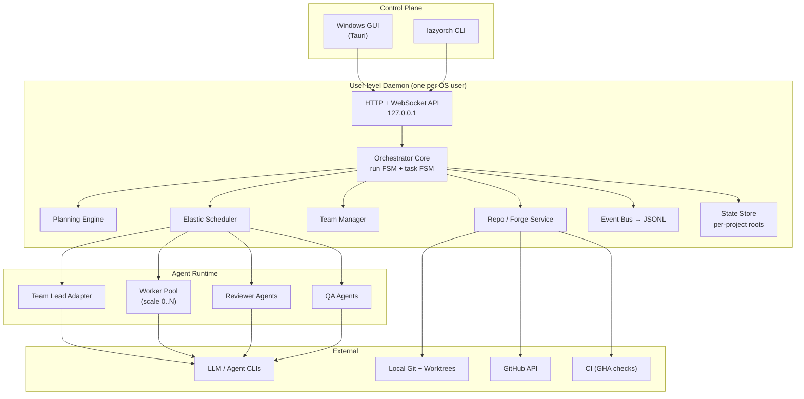
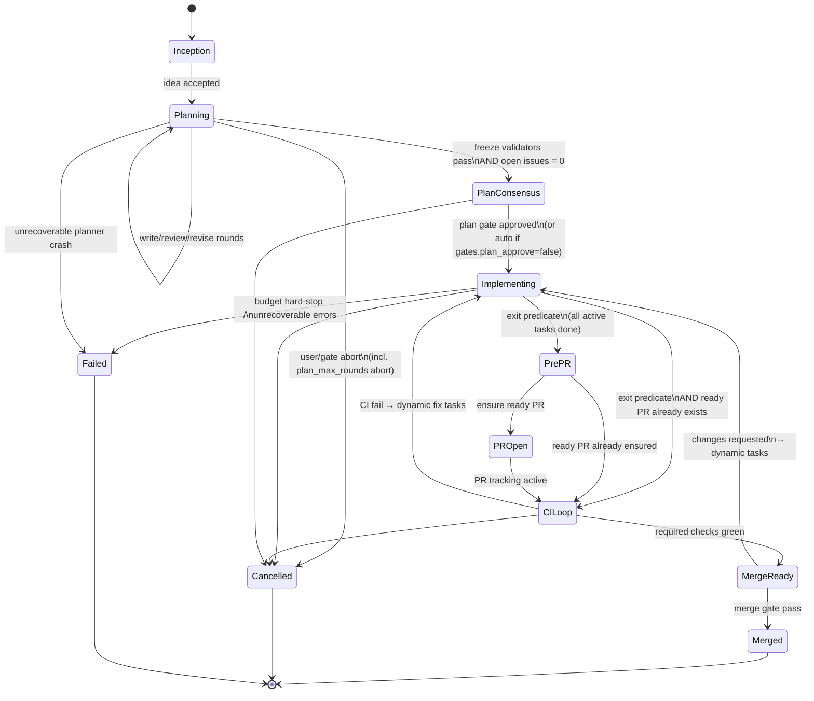
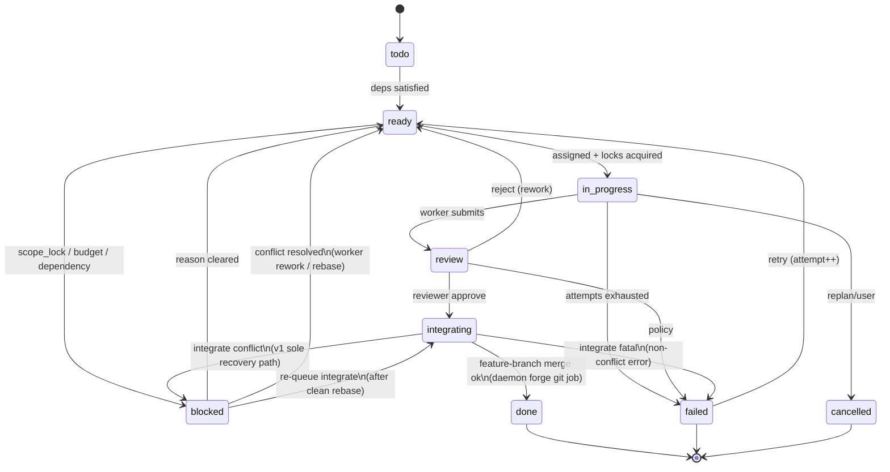
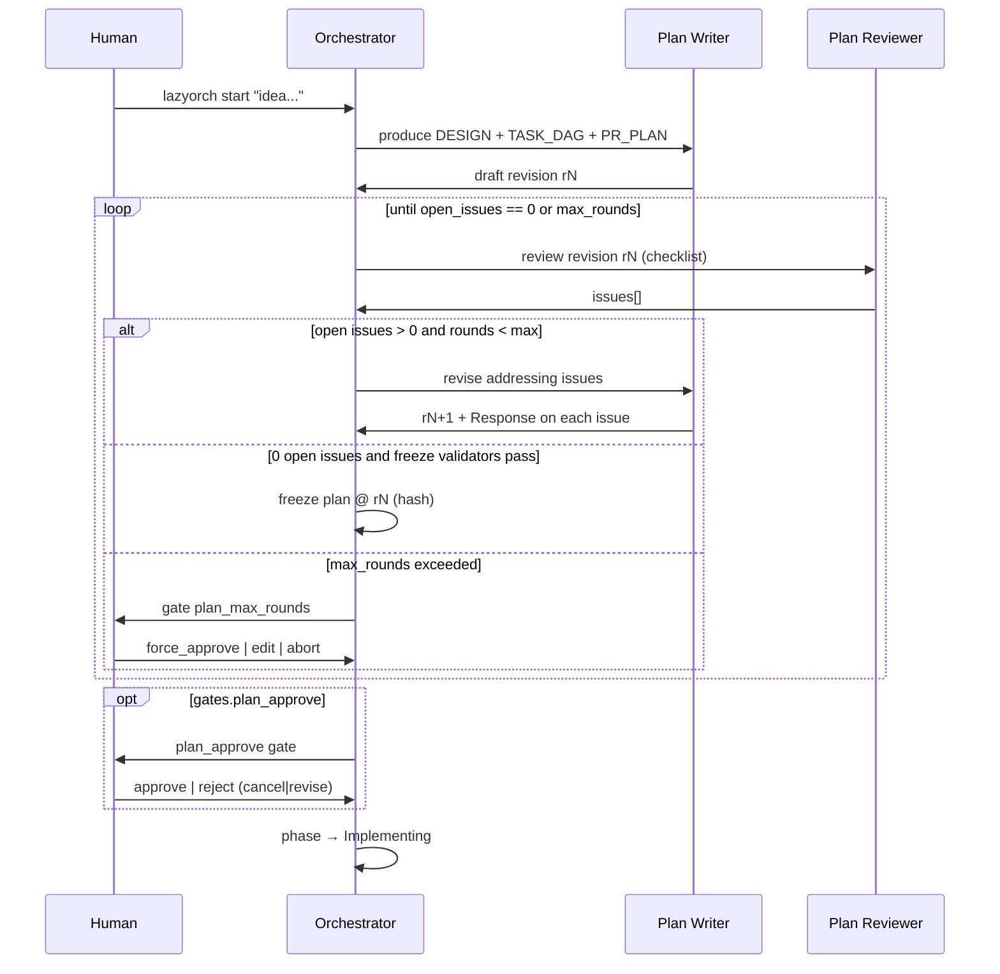
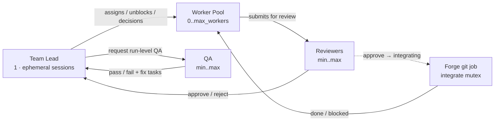
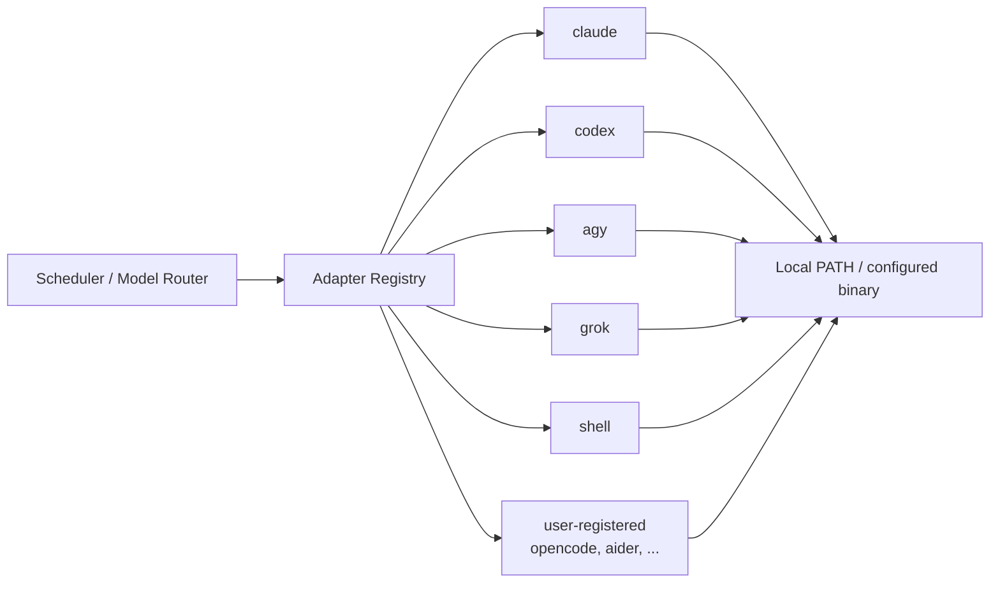
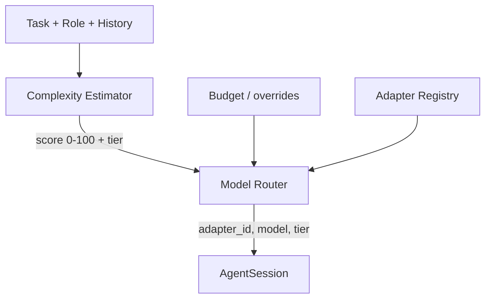
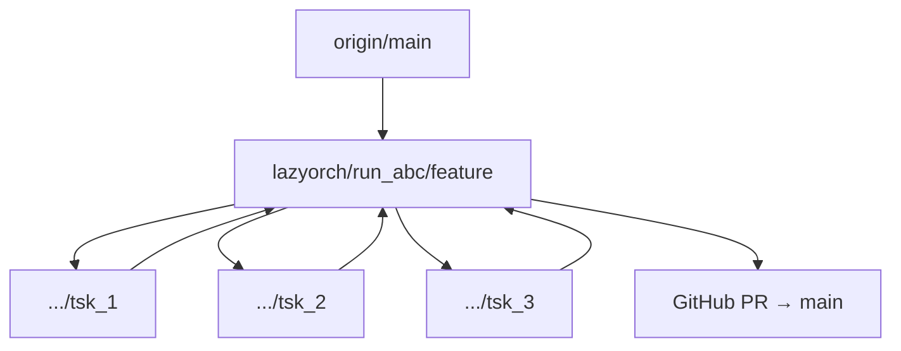
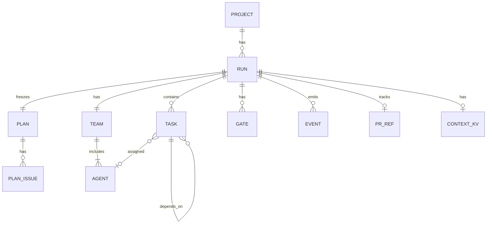
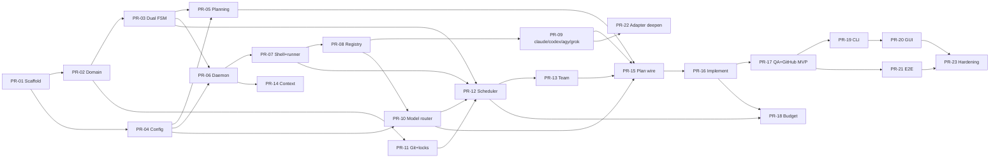

# LazyOrch — Automatic Project Orchestrator

| Field | Value |
|-------|-------|
| **Document** | Architecture Design |
| **Product** | LazyOrch (working name) |
| **Workspace** | `C:\Users\Rick\lazyorch` |
| **Author** | TBD |
| **Date** | 2026-07-31 |
| **Status** | Draft (rev 8 — MIT license; headless gate timeout fail; regex-only secret scan) |
| **Audience** | Senior engineers implementing LazyOrch from greenfield |
| **Stack (locked)** | TypeScript/Node daemon + CLI; Tauri 2 GUI (web UI + thin Rust shell) |

---

## Overview

LazyOrch is an automatic project orchestrator that turns a user **idea** into a merged pull request by deploying a coordinated team of AI agents. Unlike manual agent/task orchestrators (prior art: ORCH / `@oxgeneral/orch`), LazyOrch is **lifecycle-complete and opinionated**: the user states intent; the system runs a formal planning phase (design → review → revise until consensus), then executes implementation with an elastic worker pool, dedicated review/QA roles, git/GitHub integration, CI feedback loops, and merge gates.

The product exposes a **dual control plane**: a Windows-first GUI for operators who want visibility and one-click gates, and a first-class CLI for scripting, headless runs, and CI. Both talk to a **user-level local daemon**. Implementation language is locked: **TypeScript/Node for daemon + CLI**; **Tauri 2** (web UI + thin Rust shell) for the Windows GUI. Agents run through a **local adapter registry** (claude, codex, agy, grok, shell, plus any registered CLI) with **complexity-based model tier routing**.

**One-line thesis:** *Idea in → plan consensus → elastic multi-agent execution on the user's installed coding CLIs (right-sized models) → review/QA → PR → merge — with humans only at policy-defined gates.*

---

## Background & Motivation

### Current state

Building non-trivial software with AI agents today requires continuous human orchestration: inventing tasks, assigning agents, watching for stalls, merging worktrees, filing PRs, and re-running after CI failures. Prior art such as ORCH provides strong primitives — agents with adapters, task state machines, teams with leads, worktree isolation, org templates, and a tick-based runner — but still expects the user (or a skill wrapper) to **set up** the team and **drive** much of the lifecycle.

### Pain points

1. **Idea-to-merge is not automatic** — Users still decompose work, define review criteria, and wire PR/merge flows.
2. **Planning is optional or ad-hoc** — Agents jump to code without a design-doc-quality plan, producing thrash and rework.
3. **Team size is static** — Fixed org templates do not scale workers up/down with backlog and critical path.
4. **Control plane is CLI/TUI-centric** — Windows operators and less technical stakeholders lack a first-class GUI.
5. **Lifecycle not system-owned** — PR creation, CI loops, and merge policies are not first-class orchestrator phases with durable state machines (they may exist as agent skills the user must invoke).

### Opportunity

A product that hard-codes a **planning consensus gate** (same spirit as Grok `/design`: write → review → revise), then runs a full software delivery pipeline with elastic agents and dual control planes, can reduce human effort from continuous orchestration to intermittent **policy and quality gates**.

### Differentiation from ORCH (prior art)

| Dimension | ORCH (prior art) | LazyOrch |
|-----------|------------------|----------|
| Entry point | Init + agents + tasks/goals | Natural-language **idea** / project |
| Planning | Optional goal decomposition | **Mandatory** design phase until 0 open issues |
| Team | User/org template deployment | Auto-compose: 1 lead + elastic workers + review/QA |
| Lifecycle | Task/goal run; PR/CI/merge via agent skills or user drive | Idea → plan → implement → review → test → PR → merge as **system-owned phases** |
| Control | CLI, TUI, serve | CLI + **Windows GUI** + same daemon API |
| State | `.orchestry/` YAML | Project-local state + optional SQLite for events/metrics |
| Scaling | `max_concurrent_agents` | Elastic pool with role-aware scale policies + explicit slot accounting |

**Note on PR/merge:** ORCH agents can open PRs and ship via skills (`ship`, `land-and-deploy`, etc.) when the user/agent drives those tools. LazyOrch’s differentiation is that **PR/CI/merge are first-class orchestrator phases** with system-owned state machines, gates, and recovery — not optional agent behaviors.

LazyOrch cites ORCH as inspiration only; this is a greenfield design. No dependency on the ORCH codebase is assumed.

---

## Goals & Non-Goals

### Goals

1. **Idea-driven automation** — Accept a product/feature idea and drive through merge with minimal intermediate human input.
2. **Planning phase as a hard gate** — Writer produces design + PR/task plan; reviewer(s) critique until open issues = 0 (or human resolves disputes); implementation cannot start before plan consensus.
3. **Role-structured team** — Exactly one team lead; elastic worker pool; dedicated reviewer and QA roles (see `team.mode` for solo degradation).
4. **Dual control plane** — Equivalent capability via Windows GUI and CLI; both talk to a user-level daemon.
5. **Repo integration** — Git worktrees/branches; GitHub (v1) for PRs, checks, reviews, merge; pluggable forge later.
6. **Lifecycle completeness** — Inception → planning → implementing → pre-PR QA → PR → CI loop → merge (policy-gated).
7. **Isolation & safety** — Worktree isolation for writers; shell allowlists; approval policies per role; path-scope locks.
8. **Observability** — Structured logs, run timelines, best-effort cost estimates, stall detection, human-readable status.
9. **Incremental shippability** — Design decomposes into independently mergeable PRs (see [PR Plan](#pr-plan)).
10. **Any local coding agent CLI** — Support **all** user-installed coding agent utilities via a pluggable **local adapter registry** (not a fixed short list). First-class built-ins: **claude**, **codex**, **agy**, **grok**, plus **shell** and user-registered generics (OpenCode, Cursor agent, Aider, Gemini CLI, etc.).
11. **Complexity-based model routing** — Dynamically select model **tiers** (and concrete model ids per adapter) from estimated task complexity, with overrides, budget interaction, and escalate-on-failure.

### Non-Goals (v1)

1. **Multi-tenant SaaS** — v1 is local-first (single machine / single user managing multiple project roots).
2. **Arbitrary multi-org enterprise RBAC** — Simple local auth / machine trust only.
3. **Replacing CI systems** — Integrate with GitHub Actions (and later others); do not reimplement CI.
4. **Non-software domains as first-class** — Code-centric product delivery; content/marketing templates are out of scope for v1.
5. **Training or hosting foundation models** — Consume **locally installed** agent CLIs / utilities only (no LazyOrch-hosted LLMs). Cloud APIs are used only insofar as those CLIs already call them.
6. **Perfect autonomous merge without policy** — Default is human-gated merge; auto-merge is opt-in with strict checks.
7. **Full multi-forge parity on day one** — GitHub first; GitLab/Bitbucket/Azure DevOps as later providers.
8. **Inter-agent free-form messaging as v1 coordination** — Deferred to v1.1. v1 coordinates via task board + frozen plan + shared context KV (see [Inter-agent communication](#inter-agent-communication)).
9. **Multi-PR execution** — v1 accepts/stores `pr_mode` but **rejects starting** a run with `pr_mode: multi` until v1.1 (`features.multi_pr` must be false; `start`/`doctor` error if multi requested). No LOC heuristics; no half-implemented multi path.
10. **Rewrite hot paths in Rust** — Not a v1 fork; TypeScript daemon is the product. Tauri shell stays thin.
11. **Perfect equal depth for every adapter on day one** — Registry + first-class adapters ship in MVP; some adapters may be thinner (limited usage parse, model list heuristics) but **must be invocable** — not deferred to post-MVP.

---

## Proposed Design

### High-level architecture



**Key principle:** GUI and CLI are pure clients. All business logic lives in the **user-level daemon**. This guarantees parity and enables headless/CI usage via `lazyorch serve`.

### Implementation stack (locked)

| Layer | Technology | Rationale |
|-------|------------|-----------|
| Daemon + CLI + core | **TypeScript on Node.js ≥ 20** | Fast iteration with agent ecosystem; shared types; large contributor pool |
| Package manager | **pnpm workspaces** | Strict monorepo, fast installs on Windows |
| GUI | **Tauri 2** + web UI (React or Solid) calling HTTP/WS | Small binary; native Windows shell; no orchestration in Rust |
| Tests | Vitest + temp git fixtures | Record/replay adapter fakes for CI without LLM keys |
| Ship format | `lazyorch` npm global / standalone binary via `pkg` or similar; MSI optional later | CLI first; GUI installer at M7 |

Monorepo layout (frozen for PR-01):

```text
lazyorch/
  package.json                 # pnpm workspace root
  pnpm-workspace.yaml
  packages/
    core/                      # FSM, tasks, planning, scheduling, types
    daemon/                    # HTTP/WS server, process entry
    cli/                       # lazyorch CLI
    adapters/                  # registry + claude, codex, agy, grok, shell, generic
    forge/                     # git + github
    shared/                    # logging, ids, config schemas (zod)
  apps/
    gui/                       # Tauri 2 app
  docs/
    openapi.yaml
    design/
  tests/
    fixtures/
    e2e/
```

### Core concepts

| Concept | Definition |
|---------|------------|
| **Project** | A LazyOrch-managed workspace bound to a git repo root. State under `<repo>/.lazyorch/`. Registered with the user-level daemon. |
| **Idea** | User-provided inception text (and optional attachments, constraints, success criteria). |
| **Run** | One end-to-end lifecycle attempt for an idea. ID: `run_…`. Has exactly one **run phase** at a time. |
| **Run phase** | Coarse lifecycle stage of a run (see [Run-level state machine](#run-level-state-machine)). |
| **Task** | Executable unit with its own **task FSM**. Many tasks concurrent under `Implementing`. ID: `tsk_…`. |
| **Plan** | Design document + Key Decisions + task DAG. Artifacts under `.lazyorch/plans/`. |
| **PlanIssue** | Structured review finding (see schema below). |
| **Agent** | Role + preferred adapter(s) + policies. ID: `agt_…`. A **session** is a running process. |
| **Team** | Lead + workers + review/QA for a run, subject to `team.mode`. |
| **Worktree** | Isolated git worktree/branch for a coding task. |
| **Gate** | First-class `gate_…` entity that blocks progress until approve/reject/timeout policy. |
| **Adapter** | Named bridge to a **locally installed** coding CLI/utility (registry entry). |
| **Adapter registry** | Discovers/registers adapters: path, health, capabilities, model tier maps. |
| **Model tier** | Abstract band: `nano` \| `small` \| `medium` \| `large` \| `xlarge`. |
| **Model router** | Complexity + role + budget → tier → concrete `(adapter_id, model_id)`. |
| **Slot** | One concurrent agent **session** counting toward `max_concurrent_agents`. |

### Two-layer state machines

LazyOrch uses **two layers**. Conflating them is incorrect and must not appear in code.

#### Run-level state machine

A run has **one** coarse phase. Task review/integration happen *inside* `Implementing` as concurrent task-level activity, not as exclusive run phases.



| Run phase | Meaning | Concurrent task activity? |
|-----------|---------|---------------------------|
| **Inception** | Validating idea + project registration | No |
| **Planning** | Write/review/revise plan (sub-rounds internal) | No coding tasks |
| **PlanConsensus** | Plan frozen; waiting on `plan_approve` gate if enabled | No |
| **Implementing** | Execute task DAG; reviews, integrations, task-local QA all concurrent here | **Yes** |
| **PrePR** | Exit predicate met; run-level QA already passed this tip; prepare/ensure ready PR | No coding sessions (unless re-enter Implementing) |
| **PROpen** | Idempotent “ensure ready PR”; then hand off to CI tracking | No |
| **CILoop** | Watching checks; may re-enter Implementing for fixes | Fix tasks only when re-entered |
| **MergeReady** | Green checks; waiting on merge gate | No |
| **Merged** | Terminal success | No |
| **Cancelled** / **Failed** | Terminal (`Cancelled` = user/gate abort; `Failed` = unrecoverable system/budget) | Agents cancelled |

**Normative exit predicate: `Implementing` → next phase**

All of the following must hold (evaluated each tick):

1. Every **non-cancelled** task with `origin ∈ {plan, dynamic}` is **`done`** (or status `cancelled` only — waived/superseded tasks do not count as open work), **and**
2. No task is in `todo | ready | in_progress | review | blocked | integrating | failed`, **and**
3. Every task that reached approve has **successfully integrated** (status `done` implies integrate succeeded — see task FSM), **and**
4. Run-level QA has **passed against the current feature-branch tip**, and `qa.passed_at_commit == feature_tip_sha` (any integration after last QA invalidates QA — must re-run).

**Blocked / incomplete work never exits:** any `blocked`, `ready`, `in_progress`, `review`, `integrating`, or `failed` task (plan or dynamic) keeps the run in `Implementing`.

**Terminal failed-task escalation (normative — KD-36):**

When any plan/dynamic task is `failed` with `attempt >= max_attempts` (default 3):

| Config `scheduling.on_task_terminal_failed` | Behavior |
|---------------------------------------------|----------|
| **`gate` (default)** | Immediately open gate `human_intervention` with payload `{ task_ids, reason: "task_attempts_exhausted" }`. Run stays `Implementing`. Operator may: retry (reset attempt), cancel task(s), or abort run → `Cancelled`. |
| **`fail_run`** | After all such terminal failures are known (no pending retries), run phase → **`Failed`**. |
| **`wait`** | No auto gate (operator must poll); **discouraged** — dogfood/CI should use `gate`. |

Optional grace: if `failed_escalation_ms > 0`, wait that long after entering terminal `failed` before applying the policy (default **0** = immediate). Auto-retry does **not** loop forever: only explicit retry or gate resolution advances a terminal failure.

**Where the run goes after a successful exit:**

| Condition | Transition |
|-----------|------------|
| No `pr_ref`, or only **draft** PR | `Implementing` → `PrePR` → ensure ready PR (`PROpen` may be instantaneous) → `CILoop` |
| `pr_ref` tracks an existing **non-draft (ready) PR** | `Implementing` → **`CILoop` directly** (PrePR/PROpen are **no-ops / skipped**; forge does not create a second PR) |
| First-time path after initial plan work | Same as draft/none → PrePR → ensure ready PR → CILoop |

Dynamic tasks (CI fixes, conflict resolution, changes-requested) re-open `Implementing` from `CILoop` or `MergeReady`. On that re-entry the **same exit predicate** applies (all dynamic + remaining non-cancelled tasks terminal, re-QA at new tip).

**CI/PR re-entry profile (normative):**

1. Always re-run run-level QA after any integration since `qa.passed_at_commit`.
2. Forge ops are **idempotent**: `ensure_ready_pr(run)` — create draft if missing, undraft/mark ready if draft, no-op if ready PR already linked in `pr_ref`.
3. Never open a duplicate PR for the same run feature branch when `pr_ref.number` is set.
4. After re-exit with existing ready PR: skip PrePR/PROpen phases (or record zero-duration no-op transitions for metrics) and re-enter `CILoop` (re-poll checks).

**Multi-PR:** v1 **rejects** `pr_mode: multi` at start (see Non-Goals #9). Single-PR path only.

**Planning sub-rounds** (writer ↔ reviewer) are *not* separate run phases; they are internal to `Planning` tracked by `plan.revision` and issue list.

#### Task-level state machine



```typescript
type TaskStatus =
  | "todo" | "ready" | "in_progress" | "review"
  | "integrating"  // approved; waiting on/holding global integrate mutex
  | "done" | "failed" | "cancelled" | "blocked";

interface Task {
  id: string;                 // tsk_...
  run_id: string;
  title: string;
  description: string;
  status: TaskStatus;
  origin: "plan" | "dynamic";
  priority: 1 | 2 | 3 | 4;
  depends_on: string[];
  role_affinity: string[];    // e.g. ["backend", "worker"]
  scope: string[];            // git path globs
  acceptance: string[];       // non-empty at freeze
  review_criteria: string[];  // test_pass, typecheck, lint, custom
  workspace_mode: "worktree" | "shared" | "isolated";
  assignee?: string;
  worktree_path?: string;
  branch?: string;
  attempt: number;
  max_attempts: number;
  blocked_reason?: "scope_lock" | "human" | "dependency" | "resource" | "integrate_conflict";
  integrate_error?: string;
  needs_re_review?: boolean;  // set if conflict fix changed task-owned files beyond markers
  superseded_by_plan?: string; // plan revision id after replan
  artifacts: string[];
  // Model routing (set by plan author, lead, or router)
  tier_override?: ModelTier;
  model_override?: string;
  adapter_override?: string;
  complexity_score?: number;
  last_model_tier?: ModelTier;
  last_adapter_id?: string;
  last_model_id?: string;
}
```

**Approve vs integrate (normative):**

1. Reviewer approve moves `review → integrating` only.
2. **Integrate executor (KD-33):** Merge into the feature branch is a **daemon/forge git job** under the [global integration mutex](#feature-branch-integration-mutex). It does **not** start a lead LLM session and does **not** consume an agent slot. Lead agent sessions are only for policy, assignment, escalation, and conflict *decisions* (not the `git merge` itself).
3. Task is **`done` only after** successful merge.
4. **Integrate-conflict recovery (v1 sole path — KD-34):** On merge conflict:
   - Abort the in-flight merge; **release the integration mutex** immediately.
   - Task → **`blocked`** with `blocked_reason: integrate_conflict` (not `review` — this is not code-review rework).
   - **Keep path-scope locks** on this same task (single holder; no parallel dynamic task on the same scope).
   - Scheduler reassigns the **same task** to a worker with instructions to rebase/fix onto current feature tip (attempt may increment per policy).
   - After worker submits: if only merge markers / rebase with no material product change beyond conflict resolution → may re-enter `integrating` without full code review; if material file changes → set `needs_re_review: true` and go `review` first.
   - **Do not** spawn a second dynamic conflict task that shares `scope[]` with the blocked task (avoids scope-lock deadlock). Dynamic tasks for conflict are reserved for **conflict storms** only after human/lead policy splits scopes (rare; explicit lead decision under `human_intervention` if needed).
5. Path-scope locks do **not** replace the integration mutex.

#### Parallel tasks sequence (normative example)

Three plan tasks with no mutual deps (`T1`, `T2`) and `T3` depending on both:

```mermaid
sequenceDiagram
  participant O as Orchestrator
  participant W1 as Worker1
  participant W2 as Worker2
  participant R as Reviewer
  participant L as Lead
  participant QA as QA

  Note over O: run.phase = Implementing
  O->>W1: assign T1 (lock src/a/**)
  O->>W2: assign T2 (lock src/b/**)
  par T1 and T2 concurrent
    W1->>O: T1 → review
    W2->>O: T2 → review
  end
  O->>R: review T1
  R->>O: approve T1
  O->>O: forge git integrate T1 → feature\n(mutex; no lead agent slot)
  O->>R: review T2
  R->>O: approve T2
  O->>O: forge git integrate T2 → feature
  Note over O: T3 becomes ready
  O->>W1: assign T3
  W1->>O: T3 → review → approve → integrate
  O->>QA: ephemeral QA session\nrun-level smoke
  QA->>O: pass
  Note over O: First-time path: phase → PrePR → PROpen → CILoop
  Note over O: If ready PR already exists: Implementing → CILoop\n(see CI/PR re-entry profile)
```

*Normative example shows the **first-time** exit path. If `pr_ref` already tracks a non-draft PR, exit goes `Implementing → CILoop` (PrePR/PROpen skipped/no-op).*

### Planning phase (design-doc quality)

This phase is a first-class product feature, not a prompt suggestion. It mirrors the write → review → revise loop of Grok `/design`.

#### Artifacts

Produced under `.lazyorch/plans/<run_id>/`:

```text
.lazyorch/plans/run_abc/
  DESIGN.md
  KEY_DECISIONS.md         # or section inside DESIGN.md
  TASK_DAG.json
  PR_PLAN.md
  REVIEW.md                # human-readable issue rollup
  issues.json              # machine PlanIssue[]
  revisions/
    r001/ ...
  meta.json                # revision, status, freeze_hash, authors
```

#### Plan document required sections

1. Title & metadata  
2. Overview  
3. Background & motivation  
4. Goals & non-goals  
5. Proposed design (with diagrams where useful)  
6. API / interface changes  
7. Data model changes  
8. Alternatives considered (≥2)  
9. Security & privacy  
10. Observability  
11. Rollout / migration  
12. Open questions  
13. **Key Decisions** (mandatory summary table)  
14. **PR Plan / Task DAG** (mandatory executable breakdown)

#### PlanIssue schema

```typescript
type IssueSeverity = "low" | "medium" | "high" | "critical";
type IssueStatus = "open" | "addressed" | "wontfix";

interface PlanIssue {
  id: string;                 // iss_...
  severity: IssueSeverity;
  category: "correctness" | "security" | "scope" | "feasibility"
    | "completeness" | "clarity" | "other";
  section: string;            // e.g. "Goals", "TASK_DAG", "Security"
  description: string;
  status: IssueStatus;
  response?: string;          // required when status=addressed|wontfix
  raised_by: string;          // agent_id or "human"
  raised_at: string;          // ISO-8601
  updated_at: string;
}
```

#### Consensus algorithm



**Rules:**

1. **Distinct agents:** Default `plan_writer ≠ plan_reviewer` (separate agent instances and sessions). Only `team.mode: solo` may collapse them.
2. Writer must set `response` when moving an issue to `addressed` or `wontfix`.
3. **Dispute escalation:** If writer sets `wontfix` and reviewer re-opens the same issue with `severity ∈ {high, critical}`, open gate `plan_dispute` (blocks freeze).
4. **Max rounds** (default 5): open gate type **`plan_max_rounds`** (not `plan_dispute`) with payload actions:
   - `force_approve` — freeze with residual `open` issues re-labeled `wontfix` + `response: "force_approve residual"`; residual risks listed in `meta.json` → then normal `plan_approve` if enabled → `Implementing`
   - `edit` — human patches DESIGN/TASK_DAG; triggers one more review round (does not reset round counter unless config `planning.edit_resets_rounds`); stay in `Planning`
   - `abort` — run → **`Cancelled`** (user/operator choice — never `Failed`)
5. **Freeze validators** (all must pass; freeze rejected otherwise):
   - `TASK_DAG` is a DAG (no cycles); every `depends_on` id exists
   - Every task has non-empty `title`, `description`, `acceptance[]`, `scope[]`
   - Every task has `role_affinity` non-empty
   - `PR_PLAN` references all plan-origin task ids (coverage)
   - DESIGN.md contains required section headings (heading match, case-insensitive)
   - DESIGN.md size ≤ `planning.max_design_bytes` (default 512 KiB)
   - Scope overlaps: allowed but must be listed in `TASK_DAG.meta.overlapping_scopes[]` (lock-annotated); otherwise freeze warning→error if `planning.strict_scopes: true` (default true)
6. Frozen plan is immutable; agents receive freeze hash + paths only.
7. **Repo snapshot for writer/reviewer context:** inject (a) `git` root tree summary (depth-limited, default depth 3, max 2000 paths), (b) README and existing design docs if present, (c) optional user-attached paths, (d) never full blob dump. Cap total injected context to `planning.max_context_chars` (default `100000` characters). Token counts are model-specific and are **not** the config knob.

#### Plan reviewer checklist (injected)

- Goals/non-goals coherent and testable  
- Alternatives ≥ 2 with real trade-offs  
- Security section addresses secrets, injection, destructive ops  
- TASK_DAG executable (acceptance commands named)  
- No unbounded scope; rollout/rollback present  
- Key Decisions table non-empty  

#### Mid-run replan protocol

Triggered only by `POST /v1/runs/:id/plan/revise` or CLI `lazyorch plan revise` (opens planning cycle).

1. **Snapshot** run state → `runs/<id>/snapshots/<ts>/`.
2. **Pause** scheduler: no new assignments; cancel in-flight **agent** sessions with grace (`cancel_grace_ms`, default 30s).
3. **Drain or abort integrates** before canceling task records:
   - If any task is `integrating`: either **wait** for the in-flight forge git job to finish (success → may become `done` and stay `done`) **or** **abort** the merge (`git merge --abort` / equivalent), release the **integration mutex**, then continue.
   - Never enter `Planning` while the integration mutex is held or a merge is half-applied without abort.
4. **Preserve worktrees** for non-`done` coding tasks (do not delete); mark tasks:
   - `done` → remain `done`; commits stay on feature branch
   - `integrating` | `review` | `in_progress` | `ready` | `todo` | `blocked` | `failed` → `cancelled` with `superseded_by_plan: <new_rev>`
5. **Release path-scope locks** for every task transitioned to `cancelled` (and any locks still held by aborted integrates).
6. **Enter** `Planning` with prior freeze as input context; writer produces new revision; normal consensus applies.
7. **Human gate** `plan_approve` required before resume even if config usually auto-approves (safety).
8. **Resume:** new plan-origin tasks only for remaining work; feature branch retained; abandoned task branches kept for 7 days (`worktree_tombstone_days`).
9. **No automatic branch reset** of feature branch; lead may open dynamic “reconcile” tasks if new plan conflicts with done commits.

### Team model



#### Roles

| Role | Count (full mode) | Responsibilities | Default policy |
|------|-------------------|------------------|----------------|
| **Team Lead** | 1 agent config; **ephemeral sessions** | Execution ownership, assign policy, escalate, conflict *decisions* (not git merge) | High reasoning; `suggest` for destructive |
| **Worker** | 0..`max_workers` | Implement in worktrees; self-verify | `auto`; worktree |
| **Reviewer** | `min_reviewers`..`max_reviewers`; **ephemeral sessions** | Code review; approve/reject | Strong model; no product code push |
| **QA** | `min_qa`..`max_qa`; **ephemeral sessions** | Task-local + run-level tests/smoke | Shell + execution |
| **Plan Writer** | 1 | Author plan during Planning | High reasoning; ≠ plan reviewer |
| **Plan Reviewer** | ≥1 | Critique plan | High reasoning; adversarial |
| **Forge git (daemon)** | N/A (not an agent) | Feature-branch integrate under mutex; PR/check/merge | No LLM; no agent slot |

**Segregation:** Lead is never the sole code reviewer when `min_reviewers ≥ 1`. Plan writer and plan reviewer are distinct agent instances in `full` mode.

#### Agent session lifecycles (normative)

**All** agent roles in v1 use **ephemeral sessions** unless noted. Idle agent **configs** hold **zero** slots.

##### Lead (KD-26)

Lead is **not** a long-lived process for the whole `Implementing` phase.

| Mode | Behavior |
|------|----------|
| **Ephemeral lead sessions** | Start only when lead **agent** work is pending: unassigned `ready` tasks needing policy beyond pure auto-claim, escalation/gate prep, replan signal, conflict **decision** (e.g. storm / human), or reconcile after replan. **Not** started solely because integrate queue is non-empty — integrate is forge git (KD-33). Session **exits cleanly** when its work queue is empty. Clean exit does **not** count toward `lead.max_restarts_per_hour`. Crash/timeout/error exits **do** count; after cap → `human_intervention` gate. |
| **Slot impact** | Slot only while session running. |
| **Reservation** | `reserve_slots.lead: 1` during Planning/PlanConsensus/Implementing for **worker scale-up** free-slot math (keeps room for a lead session without starting a fake process). |
| **Orphan reaper** | `sessions.json` pid; dead → clear; no double-start if live. |

##### Reviewer (KD-35)

| Mode | Behavior |
|------|----------|
| **Ephemeral reviewer sessions** | Start when ≥1 task is in `review` (or `needs_re_review`), `active_reviewers < max_reviewers`, and free slots allow (after lead priority). Assign oldest `review` tasks first. Session **exits cleanly** when it has no remaining assigned review work and the global review queue is empty **or** the session has finished its assigned batch (implementation may exit per-task or per-batch; must not idle > `reviewer.idle_exit_ms`, default 60s). Clean exit ≠ restart budget. Crash/timeout → requeue task still in `review`; count toward `reviewer.max_restarts_per_hour` (default 6) then `human_intervention` if exhausted. |
| **Slot impact** | Slot only while session running — **no long-lived idle reviewers**. |
| **Peak contention** | `max_reviewers + max_qa` may contend with workers; packing **warn** (`1+max_workers+max_reviewers+max_qa > max_concurrent_agents`) is the operator signal. Priority order still prefers lead, then critical-path workers, then reviewers, then QA. |

##### QA (KD-35)

| Mode | Behavior |
|------|----------|
| **Ephemeral QA sessions** | Start when QA work is pending: task-local acceptance job delegated to QA, or **run-level** smoke when exit-predicate candidates are otherwise met (no open tasks except QA itself) / after tip change. Exit cleanly when the QA job completes (pass/fail report). Clean exit ≠ restart budget. Crash → retry job; `qa.max_restarts_per_hour` (default 6). |
| **Slot impact** | Slot only while session running. |

Planning-phase writer/reviewer sessions are separate agent configs (may reuse lead template for writer only when not also plan reviewer); also ephemeral per draft/review round.

#### Team modes

```yaml
team:
  mode: full   # full | solo
```

| Mode | Lead | Workers | Reviewers | QA | Compensating gates |
|------|------|---------|-----------|-----|--------------------|
| **full** | 1 | 0..max | ≥1 | ≥1 | plan_approve + merge (defaults) |
| **solo** | 1 (implements) | 0 | 0 | 0 | **Force** `gates.task_approve: true` (human approves each task), `gates.plan_approve: true`, `gates.merge: true`; plan writer=reviewer allowed |

### Concurrent slot accounting

**Definition:** `slots_used = number of RunningAgent sessions` (lead, reviewers, QA, workers all count when a process is running).

```text
slots_used ≤ max_concurrent_agents          # hard ceiling (default 8)
active_workers ≤ max_workers                # worker-only cap (default 4)
active_reviewers ≤ max_reviewers            # default 2
active_qa ≤ max_qa                          # default 2
lead sessions ≤ 1

# Soft packing invariant (validated at config load):
#   reserve_slots.lead + max_workers + min_reviewers + min_qa
#     ≤ max_concurrent_agents
# Default: 1 + 4 + 1 + 1 = 7 ≤ 8  ✓
```

**Config validation** (`init`, `doctor`, daemon load):

- **Error** if `reserve_slots.lead + max_workers + min_reviewers + min_qa > max_concurrent_agents` (cannot run full min team + max workers + reserved lead).
- **Warn** if `reserve_slots.lead + max_workers + max_reviewers + max_qa > max_concurrent_agents` (peak all-roles concurrent impossible; scheduler will starve lower priorities).

**Priority when slots are scarce** (scheduler pick order for starting a new **agent** session):

1. Lead session if none running and lead **agent** work pending (policy/assign/escalate — not git integrate)  
2. Critical-path worker (task on longest remaining dependency chain)  
3. Other ready workers by priority  
4. Reviewer for tasks in `review` (prefer oldest review queue)  
5. QA sessions  
6. Extra non-critical workers  

**Forge integrate jobs** run under the integration mutex on the daemon event loop / git worker thread pool — **outside** `slots_used` (not agent sessions).

Reviewer/QA/lead **idle** configs do not hold slots (no process). Scale pool configs exist without consuming slots until a session starts.

**Worker scale-up free slots:**

```text
free_for_workers = max_concurrent_agents
                   - slots_used
                   - (reserve_slots.lead if no lead session running
                      and phase needs lead reservation else 0)
spawn worker only if free_for_workers ≥ 1 and active_workers < max_workers
```

### Elastic worker pool — deterministic algorithm

Each scheduler tick (`tick_interval_ms`, default 5000):

```text
ready = count(tasks where status==ready and not blocked)
active_w = count(worker sessions running) + count(workers assigned but starting)
idle_w = workers with no task and last_activity > scale_down_idle_minutes

// desired worker processes (not including lead/review/QA)
desired = clamp(ceil(ready / scale_up_ready_ratio), min_workers, max_workers)

// budget soft signal: if cost unknown, ignore USD; still respect max_agent_hours
if budget_exhausted: desired = 0  // drain only

// resource pressure (optional, best-effort)
if host_mem_pct > 90 or host_cpu_pct > 95: desired = min(desired, active_w)  // no scale-up
if host_mem_pct > 95: desired = max(min_workers, active_w - 1)  // pressure scale-down of IDLE only

// cooldown: at most scale_burst workers spawned per cooldown window (default burst=1)
if desired > active_w and cooldown_elapsed:
  spawn min(desired - active_w, scale_burst) workers
  // only if free_for_workers ≥ 1 (see slot reservation for lead)

if desired < active_w and cooldown_elapsed:
  scale down only workers in state idle AND worktree_clean
  never scale down assignee of in_progress/review task
  mark selected workers draining; after exit, reap
```

**Config:**

```yaml
elasticity:
  min_workers: 0
  max_workers: 4
  scale_up_ready_ratio: 2      # desired = ceil(ready / ratio)
  scale_down_idle_minutes: 10
  cooldown_seconds: 60
  scale_burst: 1               # max spawns per cooldown
  pressure_scale_down: true

scheduling:
  max_concurrent_agents: 8     # all roles; packing: 1+4+1+1 ≤ 8
  tick_interval_ms: 5000
  stall_timeout_ms: 600000

reserve_slots:
  lead: 1                      # free slot for ephemeral lead (no process until work)
```

**Role-template matching:** On spawn, pick worker template by:

1. Intersection of ready tasks’ `role_affinity` with template tags  
2. If multiple templates match, prefer the one matching the highest-priority ready task  
3. If none match, use `fullstack-dev` fallback  

**Critical path:** `critical_path_len = longest path in remaining DAG (todo|ready|in_progress|review|integrating|blocked)` measured in task count (not hours). Hours estimates are **not** used in v1 (removed as soft signal to avoid fake precision).

**Worktree clean definition:** `git status --porcelain` empty in worktree AND no unmerged paths. **Stash-by-default is forbidden.** Dirty idle workers are marked `needs_reap_review` and never auto-deleted; lead or human must resolve.

**Metrics:** `scheduler.desired_workers`, `scheduler.active_workers`, `scheduler.scale_events`, `scheduler.slots_used`.

### Path-scope locks

**Purpose:** Prevent concurrent tasks from writing overlapping paths (KD-15). Locks are the automatic mechanism; the lead does not manually serialize unless a task is `blocked` too long and needs reprioritization.

**Algorithm:**

1. On transition `ready` → `in_progress` (assignment), compute **lock keys** from `scope[]`:
   - Normalize globs to canonical form (forward slashes, lower-case drive letters on Windows)
   - Expand to a **glob lattice**: treat `src/**` as prefix lock `src/`; treat file paths as exact keys
   - Two scopes **conflict** if one prefix contains the other or globs may match a common path (conservative: if either is `**` under same root, conflict)
2. **Acquire** all needed keys in **sorted lock-key order** (global total order → no deadlock).
3. If any key held by another task: do not assign; task stays `ready` or moves to `blocked` with `blocked_reason: scope_lock` after `scope_lock_wait_ms` (default 60s) of failed attempts.
4. Locks released on task terminal state (`done` | `failed` | `cancelled`) **after** integration or abandon decision—not at review submit. Locks **remain** while `blocked` (including `integrate_conflict`) so a dynamic task cannot steal the same scope (KD-34).
5. `workspace_mode: shared` tasks may set `skip_scope_lock: true` only if plan freeze listed them under `overlapping_scopes` with `concurrent: true` (rare; analysis tasks).

**Lead role:** May reprioritize blocked tasks or split scopes via dynamic tasks; does not bypass the lock manager.

### Feature-branch integration mutex

Path-scope locks prevent **overlapping file writes** across worktrees. They do **not** make concurrent merges into `lazyorch/<run>/feature` safe (shared ref, index, merge ordering).

**Normative rule:** Per run (feature branch), at most **one integrate operation** at a time — a **global integration mutex**.

| Rule | Detail |
|------|--------|
| **Executor** | **Daemon/forge git job only** (KD-33). No lead agent session; **no agent slot**. |
| Acquire | Task enters `integrating`; waits on mutex in dependency order among `integrating` tasks (then priority, then id) |
| Hold | `git merge` (or configured strategy) task branch → feature tip |
| Release success | Task → `done`; clear `qa.passed_at_commit` if tip moved |
| Release conflict | Mutex released; task → `blocked` + `integrate_conflict` (KD-34 sole path); path locks **stay** on that task |
| Parallelism | Independent scopes may **code** in parallel; **integrate always serial** |
| Storm | Pause elasticity; serial integrates; if same task repeatedly conflicts, escalate `human_intervention` — do **not** open a second overlapping-scope dynamic task by default |

### Task-local vs run-level QA and PR timing

| Layer | When | Who | Effect |
|-------|------|-----|--------|
| **Task-local acceptance** | Before/during task `review` | Worker + shell criteria (`acceptance[]`) | Fail → rework; not a run phase change |
| **Code review** | Task status `review` | Ephemeral reviewer agent | Approve → `integrating`; reject → ready |
| **Integration** | Status `integrating` | **Forge git job** under **integration mutex** (no agent slot) | Success → `done`; conflict → `blocked` (KD-34) |
| **Run-level QA** | Exit predicate candidates: no open tasks + tip advanced since last QA | Ephemeral QA agent | Pass records `qa.passed_at_commit = tip`; fail → dynamic fix tasks, stay `Implementing` |
| **Draft PR** | Optional, on **first successful integration** if `forge.draft_pr_on_first_integration: true` | **Forge service only** | GitHub **draft** PR; run phase stays `Implementing` |
| **Ready PR** | `PrePR` / `PROpen` or no-op if already ready | **Forge service only** (`ensure_ready_pr`) | Idempotent ready PR; then `CILoop` |

Draft PR is **forge state**, not run phase `PROpen`. See [CI/PR re-entry profile](#run-level-state-machine) for skip rules when a ready PR already exists.

**Multi-PR:** v1 stores `pr_mode: single | multi` on the plan but **`start` fails** if `multi` or if `features.multi_pr: true` is not implemented (default `false`). Multi-PR **execution is v1.1** — no partial serial-slice behavior in v1.

### Local adapter registry (any installed coding utility)

**Product requirement (authoritative):** LazyOrch must drive **any locally installed coding agent CLI / utility** the user has, not a fixed shortlist. Built-in first-class adapter ids: **`claude`**, **`codex`**, **`agy`**, **`grok`**, plus **`shell`**. Additional tools (OpenCode, Cursor agent CLI, Aider, Gemini CLI, custom wrappers) register via the same registry without core redesign (**KD-37**).



#### Registry model

```typescript
type AdapterId = string; // "claude" | "codex" | "agy" | "grok" | "shell" | user ids

type ModelTier = "nano" | "small" | "medium" | "large" | "xlarge";

interface AdapterCapabilities {
  models: string[];              // discovered or configured model ids
  tier_map: Partial<Record<ModelTier, string>>; // tier → concrete model id
  streaming: boolean;
  worktree_ok: boolean;          // safe to run with cwd = worktree
  usage_reporting: "none" | "tokens" | "tokens_and_cost";
  effort_flag?: boolean;         // supports effort/reasoning levels
  max_concurrent_hint?: number;  // adapter-side rate limit hint
}

interface AdapterRegistration {
  id: AdapterId;
  display_name: string;
  /** Resolved executable: absolute path or PATH name */
  binary: string;
  args_prefix?: string[];        // e.g. ["agent", "run"] for nested CLIs
  version_args?: string[];       // default ["--version"]
  version_floor?: string;        // semver floor for doctor
  enabled: boolean;
  /** How the entry was found. v1 enum only — plugin modules are v1.1 (KD-39). */
  source: "builtin" | "path_discover" | "user_config";
  capabilities: AdapterCapabilities;
  /** Optional: spawn env extras (never secrets in logs) */
  env?: Record<string, string>;
  /**
   * Generic/shell: command template for start.
   * Placeholders (all optional unless noted):
   *   {cwd} {model} {prompt_file} {session_dir} {timeout_ms}
   *   {binary} {args_prefix} {agent_id} {task_id}
   * Session runner substitutes after materializing prompt_file.
   */
  start_template?: string;
}

interface Usage {
  input_tokens?: number;
  output_tokens?: number;
  estimated_usd?: number;
}

interface DoctorResult {
  ok: boolean;
  adapter_id: AdapterId;
  binary_path?: string;          // resolved absolute path when found
  version?: string;              // parsed from version_args stdout
  message: string;               // human-readable status / fix hint
  unbound?: boolean;             // true if first-class id has no binary (agy/grok)
  capabilities_probe?: Partial<AdapterCapabilities>; // best-effort model list / flags
}

/** Injected runtime facts; never secrets (see Skills scrubbing). */
interface ContextBundle {
  freeze_hash: string;
  plan_dir: string;              // .lazyorch/plans/<run_id>/
  task?: Task;                   // omit for pure lead policy sessions without a task
  context_kv: Record<string, unknown>; // snapshot of runs/<id>/context.json
  feature_branch: string;
  feature_tip_sha?: string;
  run_id: string;
  project_root: string;
}

interface AgentAdapter {
  readonly id: AdapterId;
  doctor(): Promise<DoctorResult>;
  listModels?(): Promise<string[]>;
  /**
   * Map AgentSession → argv/env/stdio only. Does **not** own timeout/stall/cancel
   * process-tree kill, prompt materialization, or task FSM edges — those are the
   * session runner (see below).
   */
  start(session: AgentSession): Promise<RunningAgent>;
  /** Best-effort cancel hook; runner always falls back to process-tree kill. */
  cancel(runHandle: string): Promise<void>;
}

interface SessionResult {
  status: "ok" | "error" | "cancelled" | "timeout" | "stall";
  usage?: Usage;
  summary?: string;
  exit_code?: number;
  model_used?: string;
  adapter_id?: AdapterId;
  /** Structured outcome when present (reviewer/QA/worker markers). */
  decision?: ReviewDecision | QaDecision | WorkerMarker;
  raw_result_path?: string;      // session_dir/result.json if written
}

type ReviewDecision = {
  kind: "review";
  decision: "approve" | "reject";
  comments?: string;
};

type QaDecision = {
  kind: "qa";
  passed: boolean;
  summary?: string;
};

type WorkerMarker = {
  kind: "worker";
  submitted: boolean;            // true if worker claims work complete
  notes?: string;
};

interface RunningAgent {
  run_handle: string;            // opaque id; equals sessions.json key
  pid: number;
  adapter_id: AdapterId;
  agent_id: string;
  task_id?: string;
  session_dir: string;
  started_at: string;            // ISO-8601
  /** Resolves when process exits (or runner timeout/stall applied). */
  wait(): Promise<SessionResult>;
  /** Tail path for operator logs (stdio capture). */
  log_path: string;
}

interface AgentSession {
  agent_id: string;
  task_id?: string;
  role: string;                  // lead | worker | reviewer | qa | plan_writer | plan_reviewer
  role_prompt: string;
  skills: string[];
  adapter_id: AdapterId;       // chosen by router / override
  model: string;               // concrete model id; "n/a" for shell/deterministic
  model_tier: ModelTier | null; // null when session_kind = deterministic
  session_kind: "llm" | "deterministic";
  effort?: "low" | "medium" | "high";
  cwd: string;                 // worktree for coding tasks; project root otherwise
  env: Record<string, string>; // scrubbed
  max_turns: number;
  timeout_ms: number;
  approval_policy: "auto" | "suggest" | "manual";
  context: ContextBundle;
  complexity_score?: number;   // 0–100, from estimator; omit for deterministic
  /** Deterministic/shell only: command argv after allowlist check */
  command?: string[];
  session_dir?: string;        // set by runner before adapter.start
  prompt_file?: string;        // set by runner after materialize
}
```

#### Session runner (normative) — KD-40

**All** local adapters share one **session runner** in `packages/adapters` (used by scheduler). Adapters only translate `AgentSession` → process spawn args. PR-07 implements the runner; PR-08/09 plug adapters into it. Without this contract, multi-adapter is not implementable beyond ad-hoc shell strings.

##### Lifecycle

```text
1. Router (or deterministic path) produces { adapter_id, model, model_tier, session_kind, score? }
2. Runner allocates session_dir:
     <repo>/.lazyorch/runs/<run_id>/sessions/<run_handle>/
3. Runner materializes files (see Materialization)
4. Runner builds AgentSession (cwd, scrubbed env, prompt_file, timeout_ms, …)
5. adapter.start(session) → RunningAgent  (must not return until pid is known)
6. Runner **registers** { run_handle, pid, adapter_id, agent_id, task_id?, started_at, session_dir }
   in runs/<run_id>/sessions.json **before** start() returns to the scheduler
7. slots_used includes this session from registration until wait() settles and reaper clears
8. Runner monitors: timeout_ms, stall_timeout_ms (no log bytes + no task transition), cancel
9. On exit: parse SessionResult → apply **Result → task FSM** mapping
10. Reaper on daemon restart: dead pid → clear + stall/fail policy; live pid → re-attach logs only
```

##### Materialization

Runner **always** writes (before spawn):

| File | Content |
|------|---------|
| `prompt.md` | Concatenation in order: (1) role system preamble, (2) bound skills markdown from `packages/core/skills/`, (3) frozen plan paths + `freeze_hash`, (4) task blob (title, description, scope, acceptance, review_criteria) if any, (5) context KV snapshot as fenced JSON, (6) role-specific output contract (worker submit / reviewer decision / QA report). |
| `meta.json` | `{ run_handle, agent_id, task_id?, role, adapter_id, model, model_tier, session_kind, complexity_score?, started_at, timeout_ms, freeze_hash, cwd }` |
| `result.schema.json` | Optional copy of expected result schema for the role (documentation for the agent). |

**Who writes `prompt_file`:** the **session runner only**. Adapters never compose prompts. Secrets (`GH_TOKEN`, `GITHUB_TOKEN`, `LAZYORCH_*`, keys matching redaction regex) are **never** written into `prompt.md` or default `env`.

**Generic `start_template` placeholders** (substituted by runner after materialize):

| Placeholder | Value |
|-------------|--------|
| `{cwd}` | `AgentSession.cwd` |
| `{model}` | concrete model id (or empty / `n/a` for shell) |
| `{prompt_file}` | absolute path to `session_dir/prompt.md` |
| `{session_dir}` | absolute session directory |
| `{timeout_ms}` | session timeout |
| `{binary}` | resolved adapter binary |
| `{args_prefix}` | joined `args_prefix` if any |
| `{agent_id}` / `{task_id}` | ids when present |

Generic adapters are **thin**: no usage parse; stdout/stderr captured to `session_dir/stdio.log` only.

##### RunningAgent ownership

| Concern | Owner |
|---------|--------|
| Prompt materialization, `session_dir` | Session runner |
| `sessions.json` pid registration | Session runner (before spawn returns) |
| Timeout / stall detection | Session runner |
| Cancel → process-tree kill (Windows: `taskkill /T /F /PID`; POSIX: kill process group) | Session runner; adapter `cancel` is optional best-effort first |
| Argv / env / stdio mapping | Adapter `start` |
| Usage parse from vendor stdout | Adapter (best-effort depth) |
| Result parse → FSM | Session runner (shared parsers + role rules below) |

##### Per-adapter minimal invoke contract (v1)

| Rule | Detail |
|------|--------|
| **cwd** | Coding tasks: task worktree. Plan/lead/review without worktree: project root (or plan sandbox path). |
| **Model flag** | First-class adapters pass model via their native flag (`--model`, etc.) or config `model_flag_template`. Value = router `model_id`. Shell: no model flag. |
| **Prompt delivery** | Prefer file path (`{prompt_file}`) or stdin of `prompt.md` contents — adapter-defined; must not require interactive TTY. |
| **Cancel** | Runner kills process **tree** after `cancel_grace_ms` (default 30s) SIGTERM/equivalent. |
| **Timeout / stall** | Runner-owned; adapters do not implement their own hard kill. |
| **Exit** | Process exit starts result parse; clean exit alone is **not** always success (see mapping). |

##### Result → task FSM mapping (v1 defaults)

No inter-agent messaging in v1. Completion is **process result + optional structured files**.

**Structured sources (checked in order):**

1. `session_dir/result.json` if present and valid JSON  
2. Last non-empty stdout line if it parses as JSON with expected keys  
3. Else role-specific fallbacks below  

| Role / session | `SessionResult` outcome | Task / run effect |
|----------------|-------------------------|-------------------|
| **Worker** | `status: ok` **and** (`result.json` with `submitted: true` **or** exit_code 0 with no error marker) | `in_progress → review` (worker “submits”) |
| **Worker** | `ok` but explicit `submitted: false` | treat as `error` — attempt++ / requeue |
| **Worker** | `error` \| `timeout` \| `stall` \| non-zero without submit | attempt++; if `attempt < max_attempts` → `ready` (requeue); else → `failed` |
| **Worker** | `cancelled` | task stays `in_progress` only if replan supersede; else requeue or cancel per cancel reason |
| **Reviewer** | parse `{ decision: "approve"\|"reject", comments? }` | `approve` → `review → integrating`; `reject` → `review → ready` (rework) |
| **Reviewer** | invalid / missing decision | requeue **once** (same task stays `review`); second consecutive invalid → open `human_intervention` |
| **QA** | parse `{ passed: boolean, summary? }` | `passed: true` → record `qa.passed_at_commit = tip` (run-level) or task-local accept; `passed: false` → open dynamic fix tasks, stay `Implementing` |
| **QA** | invalid parse | retry job once; then `human_intervention` |
| **Plan writer / plan reviewer** | `ok` + artifacts written under plan dir / issues file | planning engine consumes files (not task FSM) |
| **Lead** | `ok` on empty work queue | clean exit; no task edge |
| **Any** | `timeout` / `stall` | cancel process tree; count toward role restart budget when applicable |

**Marker file convenience (optional but recommended in skills):** skills instruct agents to write `result.json` in `session_dir` (path injected in `prompt.md`). Skills `review-checklist` and `qa-runner` **must** specify the exact JSON shape above.

##### Shell / deterministic sessions

When `session_kind: "deterministic"` (shell adapter or `adapter_override: shell` / role template `session_kind: deterministic`):

- Skip complexity estimator and model tier selection (`model = "n/a"`, `model_tier = null`).
- Runner sets `command` from task `acceptance[]` entry, QA job command, or explicit task field — subject to shell allowlist.
- `SessionResult.status = ok` iff exit_code 0 and not killed; no LLM decision parse unless the command itself writes `result.json`.

#### Built-in first-class adapters

| Adapter id | Typical binary candidates (discovery order) | Notes |
|------------|-----------------------------------------------|--------|
| **claude** | `claude` | Claude Code CLI; rich models + effort when available |
| **codex** | `codex` | OpenAI Codex CLI |
| **agy** | `agy`, then user-configured path | **First-class label as specified.** Exact binary may vary — registry **binds** whatever path the user installs under this id (PATH search + config override). `doctor` reports unbound if not found. |
| **grok** | `grok`, `grok-cli`, `xai` (configurable candidates) | xAI Grok coding CLI/agent if installed locally; candidate list overridable in config |
| **shell** | OS shell / direct argv | **Deterministic** sessions only (tests, linters, acceptance scripts). No model tiers (`tier_map` empty / N/A). Not a coding-agent fallback — see [Shell vs LLM routing](#shell-vs-llm-routing-normative). |

**Thin vs deep (honest capability matrix):** MVP requires each first-class adapter to be **startable + cancellable + doctor-detectable**. Optional depth (usage parse, native model list, streaming) may land unevenly:

| Capability | claude | codex | grok | agy | shell | generic |
|------------|--------|-------|------|-----|-------|---------|
| doctor / version | Required | Required | Required | Required | Required | Required |
| start session | Required | Required | Required | Required | Required | Required |
| cancel | Required | Required | Required | Required | Required | Required |
| model flag pass-through | Required | Required | Required | Best-effort | N/A | Template |
| usage parse | Best-effort | Best-effort | Best-effort | Best-effort | none | none |
| worktree cwd | Required | Required | Required | Required | Required | Config |

#### Discovery & registration

1. **Builtin catalog** loads default candidates for claude/codex/agy/grok/shell.
2. **PATH discovery:** for each candidate binary name, resolve on `PATH` (Windows: `where.exe` / `PATHEXT`).
3. **User config** (`adapters.registry[]` or per-id `binary:`) **overrides** path and args — authoritative for agy/grok when auto-discover fails.
4. **Generic registration:** any tool:
   ```yaml
   adapters:
     registry:
       - id: aider
         binary: "C:\\Tools\\aider.exe"
         start_template: "aider --model {model} --yes"
         capabilities:
           tier_map: { small: "gpt-4o-mini", large: "gpt-4o" }
   ```
5. **`lazyorch doctor`:** lists each registered id: found path, version, enabled, capability flags; exit non-zero if **no** coding adapter (non-shell) is healthy when a run is requested.
6. **`lazyorch adapter list|register|test`:** CLI management (API mirrors).
7. **Plugins (v1.1 only — out of v1 registry `source` enum):** JS/TS module exporting `AgentAdapter`. v1 registration is **builtin + PATH discover + user_config `registry[]` only** (KD-39). Do not add `"plugin"` to v1 types.

**Default adapter selection for a session:** model router picks among **enabled healthy** adapters that support the chosen tier (see below); user may pin `adapters.default` and per-role preferences.

#### Cost policy (unchanged principles)

- If `budget.max_usd_per_run` set and cumulative `estimated_usd` known → hard-stop when exceeded.
- If cost **unknown**: enforce `max_agent_hours`, `max_run_hours`, concurrency caps only; **prefer lower tiers** when USD unknown and hours budget tight.
- `budget.model_rates` + tier-level default rates for estimates when adapters only return tokens.

---

### Dynamic model selection (complexity → tier → model)

**Product requirement (authoritative):** Do not hardcode one model per role only. Route each session by **estimated task complexity** to a **model tier**, then to a concrete model id for the chosen adapter (**KD-38**).



#### Complexity estimator (normative defaults — KD-41)

```typescript
interface ComplexitySignals {
  role: string;                    // lead | worker | reviewer | qa | plan_writer | plan_reviewer
  task_origin: "plan" | "dynamic";
  task_type_labels: string[];      // from plan: feature|bugfix|refactor|docs|test|security|migrate
  scope_path_count: number;        // expanded or estimated path keys
  scope_loc_est?: number;          // optional from git/cloc; 0 if unknown
  depends_on_count: number;
  is_critical_path: boolean;
  prior_failures: number;          // max(0, attempt - 1)
  risk_labels: string[];           // security, public_api, data_migration, ...
  plan_estimate_tier?: ModelTier;  // optional author hint on TASK_DAG node
  acceptance_command_count: number;
  title_desc_chars: number;
}

/** Returns score in [0, 100] and suggested tier before overrides */
function estimateComplexity(s: ComplexitySignals, w = DEFAULT_WEIGHTS): { score: number; tier: ModelTier } {
  let score = roleBase(s.role, w);
  score += Math.min(w.scope_path_cap, s.scope_path_count * w.scope_path_points);
  score += locBucket(s.scope_loc_est, w);
  score += Math.min(w.depends_cap, s.depends_on_count * w.depends_points);
  score += Math.min(w.acceptance_cap, s.acceptance_command_count * w.acceptance_points);
  score += Math.min(w.title_desc_cap, Math.floor(s.title_desc_chars / w.title_desc_chars_per_point));
  if (s.is_critical_path) score += w.critical_path_points;
  score += s.prior_failures * w.prior_failure_points;
  // security-class risk: apply at most once
  const securityHit =
    s.risk_labels.some(r => ["security", "public_api", "data_migration"].includes(r))
    || s.task_type_labels.includes("security");
  if (securityHit) score += w.security_risk_points;
  score += planTierSoftPrior(s.plan_estimate_tier, score, w);
  score = clamp(score, 0, 100);
  return { score, tier: scoreToTier(score) };
}
```

**Default role base scores** (`models.complexity_weights.role_base`):

| Role | Base points |
|------|------------:|
| `plan_writer` | 70 |
| `plan_reviewer` | 70 |
| `lead` | 50 |
| `reviewer` | 45 |
| `worker` | 30 |
| `qa` | 25 |
| other / unknown | 30 |

**Default additive weights** (all under `models.complexity_weights`; overridable):

| Key | Default | Rule |
|-----|--------:|------|
| `scope_path_points` | 3 | per scope path key |
| `scope_path_cap` | 24 | max from scope paths |
| `loc_0` | 0 | `scope_loc_est` missing or 0 |
| `loc_1_50` | 4 | 1–50 LOC |
| `loc_51_200` | 10 | 51–200 |
| `loc_201_800` | 18 | 201–800 |
| `loc_801_plus` | 28 | ≥801 |
| `depends_points` | 2 | per `depends_on` entry |
| `depends_cap` | 12 | max from deps |
| `acceptance_points` | 2 | per acceptance command |
| `acceptance_cap` | 10 | max from acceptance |
| `title_desc_chars_per_point` | 120 | 1 point per N chars of title+description |
| `title_desc_cap` | 8 | max from text length |
| `critical_path_points` | 10 | if task on critical path |
| `prior_failure_points` | 15 | × `prior_failures` (attempt−1) |
| `security_risk_points` | 20 | if any security-class risk label / type (apply **once**) |
| `plan_soft_prior_points` | 8 | pull score toward plan tier midpoint by at most this many points |

**LOC bucket helper:** pick exactly one of `loc_*` from `scope_loc_est`; if unknown, `loc_0` (0).

**Plan soft prior:** if `plan_estimate_tier` set, let `mid` = midpoint of that tier’s score band (nano 10, small 30, medium 50, large 70, xlarge 90). Then  
`score += clamp(mid - score, -plan_soft_prior_points, +plan_soft_prior_points)`  
(i.e. move at most ±8 toward the plan author’s tier midpoint).

**Clamp:** `score = min(100, max(0, round(score)))`.

**Default score → tier bands** (`models.score_bands`; stable contract for tests):

| Score | Tier | Typical use |
|------:|------|-------------|
| 0–20 | `nano` | Trivial edits, pure lint/format (if LLM used at all) |
| 21–40 | `small` | Small scoped fix, simple tests |
| 41–60 | `medium` | Standard feature slice |
| 61–80 | `large` | Cross-cutting, architecture-sensitive, security |
| 81–100 | `xlarge` | Plan writing/review, lead hard decisions, multi-module refactors |

**Bands and role floors are the stable API** for PR-10 unit tests. Weights are config-overridable defaults; changing weights without changing bands is allowed for operator tuning.

**Role floors (defaults):** plan_writer / plan_reviewer ≥ `large`; lead ≥ `medium`; code reviewer ≥ `medium`; worker ≥ `small`; qa ≥ `small`. Floors/ceilings apply in the router **only when not pin-locked** (step 4d); never inside the raw estimator.

#### Shell vs LLM routing (normative)

Two mutually exclusive session paths:

| Path | When | Router behavior |
|------|------|-----------------|
| **Deterministic** | `task.adapter_override == "shell"` **or** role/task template `session_kind: deterministic` **or** scheduler job type is scripted acceptance/QA command with `adapter_id: shell` | **Skip** complexity estimator and tier selection. Set `session_kind: "deterministic"`, `model: "n/a"`, `model_tier: null`, `adapter_id: shell`. Invoke shell adapter with allowlisted command from task `acceptance[]` / QA job. |
| **LLM** | All other agent sessions (workers, reviewers, lead, plan roles, QA when using an LLM adapter) | Full router algorithm below. **`pickAdapter` never selects `shell`** as a coding fallback. `shell` in `adapters.preference_order` is ignored on the LLM path (or may be listed last for documentation only). |

**Defaults:**

- **Workers / lead / plan_writer / plan_reviewer / code reviewer:** LLM path; preferred coding adapters only.
- **QA:** may use **deterministic** shell for run-level smoke / task acceptance commands when the QA job is a fixed command list; may use **LLM** path when the QA role template prefers an LLM adapter for exploratory test authoring. Template field `session_kind` chooses.
- Coding agents may still run allowlisted shell **tools inside** an LLM session — that is **not** the shell adapter and does not set `adapter_id: shell`.

#### Router algorithm (normative)

On each **LLM** session start (assignment, review, plan write, etc.). If deterministic path matched above, skip to session start with shell.

**Single enable flag:** `models.routing_enabled` (default `true`). Config key `features.model_routing` is an **alias** of the same boolean at load time (if either is false → routing off). Prefer setting only `models.routing_enabled` in new configs.

```text
0. If session is deterministic → shell path; stop (no score/tier).
1. If models.routing_enabled == false:
     tier = role_tier_floor[role] ?? "medium"
     adapter_id = task.adapter_override
                  ?? first healthy preferred_adapters[]
                  ?? adapters.default (if healthy)
                  ?? first healthy non-shell in preference_order
     model_id = tier_map[adapter_id][tier] ?? fail doctor hint
     reason = "routing_disabled"; goto persist/start
2. signals = collectComplexitySignals(task, role, run)
3. { score, tier } = estimateComplexity(signals)   // raw estimate
4. Apply pins, then constraints (pin-locked skips floor/ceiling/budget):
   a. Task pin (highest): if task.model_override → lock model_id
      (tier = known tier for that model if map has it; else leave tier as estimate
       for observability only — floors/ceilings/budget still skipped when pin_locked);
      else if task.tier_override → tier = that tier
   b. Run / CLI / GUI pin: run.tier_pin / --tier / --model / --adapter from start
      (beats lead; does not beat task pin). Same model/tier lock rules as 4a.
   c. Lead pin: task fields or context KV model_pin/* set by lead (if allowed)
   pin_locked = true if any of 4a–c set tier_override or model_override
                 (adapter_override alone does NOT set pin_locked)
   d. Role floor / ceiling — **only if not pin_locked**:
        tier = max(tier, role_tier_floor[role] ?? nano)
        if role_tier_ceiling[role] set → tier = min(tier, ceiling)
      // If pin_locked: do NOT raise to floor, do NOT lower to ceiling
   e. Budget pressure — **only if not pin_locked**:
        if remaining USD or hours below threshold,
          tier = min(tier, models.budget_tier_cap)  // default "medium"
        // Floor may be violated here — see floor vs cap rules
      // If pin_locked: skip budget_tier_cap (pins beat budget; no floor_violated)
   reason = "override" if pin_locked else (set later: estimate / budget_cap / …)
5. adapter_id = pickAdapter(role, tier, config)  // LLM path only:
   - Prefer task.adapter_override if healthy and (supports tier or is non-shell coding)
   - Else first healthy in agent.preferred_adapters[] that supports tier
   - Else adapters.default if healthy and supports tier
   - Else first healthy **non-shell** adapter in adapters.preference_order
     that has tier_map[tier]
   - Else step-down: for t = nextLower(tier) … nano, retry preference_order
     (still non-shell only). Record reason tier_map_gap if final tier < pre-step-down
     and not pin_locked. If pin_locked and no adapter supports pinned tier/model →
     error "no adapter for pin" (do not silently step below an intentional pin).
   - Else error "no adapter for tier" (doctor hint)
6. model_id = registry[adapter_id].capabilities.tier_map[tier]
             ?? adapters.models[adapter_id][tier]
             ?? fail with doctor hint
   // If 4a–c locked model_override, use that string instead when adapter accepts it
7. effort = mapTierToEffort(tier)  // large/xlarge → high, medium → medium, else low
8. Persist on task/session: complexity_score, model_tier, adapter_id, model_id
9. Emit model.routed; start AgentSession via session runner
```

**`pin_locked` (normative):** `true` when task, run/CLI/GUI, or lead supplies `tier_override` or `model_override`. When `pin_locked`:

- Skip role floor raise and role ceiling lower (step 4d).
- Skip budget tier cap (step 4e). Pins beat floor, ceiling, and budget without a gate.
- Emit `reason: "override"`. Do **not** set `floor_violated` for an intentional pin (even if the pinned tier is below the role floor or above the ceiling).
- `adapter_override` alone does not pin the tier; floors/ceilings/budget still apply to the estimated tier.

**Override priority (frozen, highest → lowest):**

1. **Task pin** — `tier_override` / `model_override` / `adapter_override` on the task  
2. **Run / CLI / GUI pin** — `lazyorch start --tier|--model|--adapter`, GUI run settings  
3. **Lead pin** — lead-set task fields / `model_pin/*` context  
4. **Role floor / ceiling** — applied only when not `pin_locked`  
5. **Estimator score → tier** — seed for unpinned path; replaced by pin when locked  
6. **Budget tier cap** — applied only when not `pin_locked`; may set `floor_violated`  
   (tier_map step-down is adapter availability on the unpinned path only — not a pin)

**Floor vs ceiling vs budget vs pin (normative):**

| Situation | Default behavior | `models.strict_role_floors: true` |
|-----------|------------------|-----------------------------------|
| Budget cap would set tier **below** role floor (unpinned) | **Allow**; emit `model.routed` with `reason: "budget_cap"` and `floor_violated: true`; metric `router.floor_violations` | **Hard-fail** session start unless `budget_override` gate approved |
| tier_map step-down lands **below** role floor (unpinned) | **Allow**; `reason: "tier_map_gap"` + `floor_violated: true` | **Hard-fail** (or try other adapters first — already done); then gate/error |
| Task/run/lead pin **below** role floor | **Pin wins**; `reason: "override"`; no `floor_violated` | **Pin still wins** (pins are intentional; `strict_role_floors` does not override pins) |
| Task/run/lead pin **above** role ceiling | **Pin wins**; `reason: "override"`; ceiling not applied | **Pin still wins** |
| Task/run/lead pin vs budget cap | **Pin wins**; skip `budget_tier_cap`; no `budget_cap` reason | **Pin still wins** |

**PR-10 unit test (required):** `role: plan_writer` (floor `large`) + `tier_override: nano` → session `model_tier == "nano"`, `reason == "override"`, `floor_violated` absent/false. Mirror case: pinned tier above an optional ceiling still keeps the pin.

**Escalate on failure (re-route) — no double-bump:**

When a task fails or is rejected for quality and `attempt < max_attempts`, re-run the **full** router algorithm with step 3 replaced as follows (pins still apply via 4a–c):

```text
// Replace step 3 only; then run full steps 4a–9 (not a 4d-only resume).
prior_failures = attempt - 1   // already feeds estimator (+prior_failure_points)
{ score, tier_est } = estimateComplexity(signals with updated prior_failures)
tier = tier_est
if models.escalate_on_failure
   and consecutive_quality_fails >= models.escalate_after_failures:  // default 1
     tier = max(tier_est, nextTier(last_model_tier))
     // one step of max(); NOT estimate-bump then additional blind nextTier
tier = min(tier, models.max_tier)
// Continue at step 4a (pins → pin_locked → floor/ceiling if unpinned →
// budget if unpinned → pickAdapter → model_id → persist → emit).
// If pin_locked after 4a–c, reason remains "override" (pin beats escalate seed).
// If not pinned and escalate raised tier, reason = "escalate" (unless budget/step-down later).
```

- `nextTier` is a single step: nano→small→medium→large→xlarge.  
- Score-driven rise from `prior_failure_points` and the escalate `max(..., nextTier(last))` are **combined via max**, never stacked as two mandatory extra bumps.  
- May switch adapter if current adapter lacks the chosen tier (unpinned path only for silent step-down).  
- Never escalate past `models.max_tier` on the unpinned path; budget cap still applies only when not `pin_locked` (pins beat budget without `budget_override`).

**De-escalate:** not automatic mid-task; optional next-task preference when budget pressure high.

#### Config schema (models + adapters)

```yaml
adapters:
  default: claude
  # shell listed for discoverability; ignored on LLM pickAdapter path
  preference_order: [claude, codex, grok, agy, shell]
  # First-class builtins always registered; enable/disable and paths:
  claude:
    enabled: true
    binary: null              # null = PATH discover "claude"
    version_floor: "1.0.0"
  codex:
    enabled: true
    binary: null              # PATH "codex"
  agy:
    enabled: true
    binary: null              # PATH "agy" or set explicit path
    candidates: ["agy"]       # discovery names
  grok:
    enabled: true
    binary: null
    candidates: ["grok", "grok-cli", "xai"]
  shell:
    enabled: true
  registry: []                # additional user adapters (aider, opencode, ...)
  # Per-adapter concrete models for tiers (override capability defaults):
  models:
    claude:
      nano: "claude-haiku-4-5"
      small: "claude-haiku-4-5"
      medium: "claude-sonnet-4-6"
      large: "claude-sonnet-4-6"
      xlarge: "claude-opus-4-6"
    codex:
      small: "o4-mini"
      medium: "o4-mini"
      large: "gpt-5"
      xlarge: "gpt-5"
    grok:
      small: "grok-3-mini"
      medium: "grok-3"
      large: "grok-3"
      xlarge: "grok-4"
    agy:
      # Fill with whatever models the installed agy CLI accepts
      small: "default"
      medium: "default"
      large: "default"
      xlarge: "default"

models:
  routing_enabled: true         # authoritative; features.model_routing aliases this
  strict_role_floors: false     # true → unpinned budget/step-down cannot go below floor without gate; pins still win
  escalate_on_failure: true
  escalate_after_failures: 1
  max_tier: xlarge
  budget_tier_cap: medium       # when budget remaining < budget_pressure_threshold
  budget_pressure_threshold_usd: null
  budget_pressure_threshold_hours: 0.25
  role_tier_floor:
    plan_writer: large
    plan_reviewer: large
    lead: medium
    reviewer: medium
    worker: small
    qa: small
  role_tier_ceiling: {}         # optional caps per role
  score_bands:
    nano: [0, 20]
    small: [21, 40]
    medium: [41, 60]
    large: [61, 80]
    xlarge: [81, 100]
  complexity_weights:
    role_base:
      plan_writer: 70
      plan_reviewer: 70
      lead: 50
      reviewer: 45
      worker: 30
      qa: 25
    scope_path_points: 3
    scope_path_cap: 24
    loc_0: 0
    loc_1_50: 4
    loc_51_200: 10
    loc_201_800: 18
    loc_801_plus: 28
    depends_points: 2
    depends_cap: 12
    acceptance_points: 2
    acceptance_cap: 10
    title_desc_chars_per_point: 120
    title_desc_cap: 8
    critical_path_points: 10
    prior_failure_points: 15
    security_risk_points: 20
    plan_soft_prior_points: 8
```

#### Overrides

| Source | Field | Priority (frozen) |
|--------|-------|-------------------|
| Task (plan or dynamic) | `tier_override`, `model_override`, `adapter_override` | **1 highest** (`tier`/`model` set `pin_locked`) |
| Run / CLI / GUI | `lazyorch start --tier large --adapter codex` | **2** (`tier`/`model` set `pin_locked`) |
| Lead | sets same fields / context `model_pin/*` | **3** (`tier`/`model` set `pin_locked`) |
| Role config | floors/ceilings | **4** — skipped when `pin_locked` |
| Estimator | score → tier | **5** — seed; replaced by pin when locked |
| Budget / tier_map gap | cap or step-down | **6 lowest** — skipped when `pin_locked`; unpinned path may set `floor_violated` |

#### Interaction with elasticity & lead

- Model tier does **not** change slot accounting (one session = one slot regardless of model size).
- Higher tiers may increase `timeout_ms` defaults (`models.tier_timeout_ms.xlarge`).
- Lead may pin tiers for critical-path tasks (priority 3); task and run pins beat lead. When any pin sets `pin_locked`, floor/ceiling/budget are not applied (pins beat all three).
- Elastic worker spawn selects adapter/model **at assignment time** via router (not at pool create).

#### Observability

Metrics: `router.tier_selected`, `router.complexity_score`, `router.escalations`, `router.floor_violations`, `adapter.session_starts{adapter,model,tier}`.  
Events: `model.routed` payload `{ task_id, role, score, tier, adapter_id, model, reason, floor_violated? }` where  
`reason ∈ "estimate" | "override" | "escalate" | "budget_cap" | "tier_map_gap" | "routing_disabled" | "deterministic"`.

### Skills and shell safety (v1)

Minimal built-in skill pack (markdown prompts under `packages/core/skills/`):

| Skill | Purpose |
|-------|---------|
| `careful` | Refuse destructive git/fs unless gate; confirm before `rm -rf`, force-push |
| `freeze-scope` | Restrict edits to task `scope[]` |
| `review-checklist` | Structured code review output |
| `plan-writer` | Design doc + DAG schema instructions |
| `plan-reviewer` | Adversarial plan checklist |
| `qa-runner` | How to run acceptance and report |

**Default bindings:**

| Role | Skills |
|------|--------|
| Plan Writer | `plan-writer`, `careful` |
| Plan Reviewer | `plan-reviewer` |
| Lead | `careful`, `freeze-scope` |
| Worker | `careful`, `freeze-scope` |
| Reviewer | `review-checklist` |
| QA | `qa-runner`, `careful` |

**Shell adapter allowlist** (config) — **worker/QA/lead agent sessions**:

```yaml
shell:
  # Agent sessions: local tools only. GitHub network ops are forge-owned (v1).
  allowed_commands:
    - git
    - npm
    - pnpm
    - node
    - npx
    - vitest
    - tsc
    - eslint
    # optional: cargo, python, go — project-specific
  deny_patterns:
    - "rm -rf /"
    - "git push --force"
    - "git push -f"
    - "format\\s+[A-Za-z]:"
  # Outside allowlist requires approval_policy suggest/manual or gate
```

**GitHub credentials & `gh` (normative):**

- **`gh` is not** on the default agent shell allowlist.
- PR open/undraft, check polling, and merge run only in the **forge service** process, which may invoke `gh` / GitHub API with credentials from the OS store or `LAZYORCH_GITHUB_TOKEN`.
- Agent session env is **scrubbed**: no `GH_TOKEN`, `GITHUB_TOKEN`, or `LAZYORCH_*` secrets in worker/lead/reviewer/QA prompts or default env.
- Agents may use **local `git`** (fetch/commit/merge in worktrees). They must not be expected to `gh pr create`.
- Future opt-in `forge_proxy` or audited credential mode is non-goal for v1 defaults.

No ORCH-scale skill marketplace in v1.

### Worktree & git strategy

**Default worktree root:**

- Non-Windows: `<repo>/.lazyorch/worktrees/<task_id>/`
- **Windows default:** `%USERPROFILE%\.lazyorch\worktrees\<project_hash>\<task_id>\` (short root outside repo) to reduce path-length and Defender scan cost on the repo tree. Override with `workspace.worktree_root`.

Branch naming: `lazyorch/<run_id>/<task_id>`; feature branch: `lazyorch/<run_id>/feature`.



**Cleanup:** On `done` after integration, remove worktree if clean; keep branch until run terminal + tombstone. Never stash-auto. **Long paths:** document `git config core.longpaths true` and Defender exclusions for worktree root in operator runbook.

### Inter-agent communication

**v1 (in scope):**

| Mechanism | Role |
|-----------|------|
| **Task board** | Primary coordination (statuses, assignees, blockers) |
| **Frozen plan + TASK_DAG** | Contracts, API shapes, acceptance — source of truth for cross-task design |
| **Shared context KV** | Small durable key/value (`context set/get`) for runtime facts (e.g. generated port number); stored in `runs/<id>/context.json` |

**v1.1 (deferred — Non-Goal #8):** directed/broadcast messages (`msg_…`) with TTL and inbox APIs. Avoid free-form multi-agent chat as source of truth even then.

Workers always receive: freeze hash, plan path, task blob, and current context KV snapshot.

### Human gates (complete inventory)

```typescript
type GateType =
  | "plan_approve"
  | "plan_dispute"
  | "plan_max_rounds"    // force_approve | edit | abort
  | "task_approve"       // solo mode or manual override
  | "merge"
  | "destructive_git"
  | "budget_override"
  | "human_intervention"; // lead/system unrecoverable

interface Gate {
  id: string;             // gate_...
  type: GateType;
  run_id: string;
  status: "pending" | "approved" | "rejected" | "timed_out";
  created_at: string;
  timeout_at?: string;
  payload: Record<string, unknown>; // e.g. action for plan_max_rounds
}
```

| Gate type | Blocks | Approve / resolve effect | Reject / abort effect | Default timeout | `--yes` skip? |
|-----------|--------|--------------------------|----------------------|-----------------|---------------|
| `plan_approve` | Leave PlanConsensus | → Implementing | Per `gates.plan_reject_action`: **`cancel`** (default) → Cancelled; **`revise`** → stay/return Planning | notify @ 1h; `timeout_action: none` | Only if `gates.plan_approve: false` or `--yes` **and** `gates.allow_yes_plan: true` (default **false**) |
| `plan_dispute` | Freeze while high/critical wontfix disputed | Human resolution applied (accept wontfix or force addressed) → continue consensus | → **Cancelled** | notify @ 1h | No |
| `plan_max_rounds` | Planning when rounds exhausted | Payload **action**: `force_approve` → freeze (+ residual risks); `edit` → human patch + one more review (stay Planning). Gate resolves as approved with action. | Payload **`abort`** or reject → **Cancelled** (not Failed) | notify @ 1h | No |
| `task_approve` | Task `review`→`integrating` (solo) | → integrating | task → ready (rework) | notify @ 4h | No |
| `merge` | Merged | call forge merge | stay MergeReady; optional comment | notify @ 1h | Only if `merge_gate: auto` |
| `destructive_git` | Specific op | perform op once | skip op; task may fail | notify @ 15m | No |
| `budget_override` | Continue after budget hit | raise ceiling / continue | → **Failed** | notify @ 30m | No |
| `human_intervention` | Run progress | resume after operator fix | → **Cancelled** | notify @ 30m | No |

**Cancelled vs Failed:** User/gate **abort** and operator reject-to-stop → `Cancelled`. Budget hard-stop without override, unrecoverable planner/daemon corruption → `Failed`. Max-rounds **abort** is always `Cancelled`.

**Resume:** The **only** way past a blocking `pending` gate is approve/reject (or timeout policy). Scheduler does not soft-skip.

**Gate timeout policy (KD-44):** After notify (`timeout_notify_hours`, default 1h for most gates), if the gate is still `pending`:
- `timeout_action: none` — **interactive default**: leave gate `pending`; emit notify events only (operator may still approve/reject later).
- `timeout_action: cancel` — gate → `timed_out`; run → **Cancelled** (opt-in; ambiguous for unattended CI).
- `timeout_action: fail` — gate → `timed_out`; run → **Failed**; CLI/daemon exit non-zero so CI fails closed.
- **Never** auto-approve on timeout.
- **Headless/CI effective default: `fail`** when `CI=true`, `--headless`, or unattended/non-TTY start without an explicit `gates.timeout_action` override. Safe default: block the run rather than cancel or auto-approve.

**CLI:** `lazyorch gate list` shows pending gates across projects (daemon-global). Exit code `3` when a command cannot proceed because a gate is pending. `lazyorch start --yes` skips only gates explicitly allowlisted in config (default: none of the safety gates).

### Failure modes and recovery

| Failure | Severity | Recovery |
|---------|----------|----------|
| Lead session timeout/crash | High | Ephemeral lead: restart only if agent work pending; clean exits ignored for restart budget; crash/timeout → `lead.max_restarts_per_hour` then `human_intervention` |
| N consecutive lead assignment failures | High | `human_intervention` gate; pause workers |
| Worker stall (`stall_timeout_ms` with no log bytes **and** no task state transition) | Medium | Cancel session; increment attempt; requeue task or fail at max_attempts |
| Reviewer/QA crash | Medium | Ephemeral: requeue job; task stays `review` / QA pending; crash counts toward role restart budget; clean exit does not |
| Reviewer/QA clean exit | Low | Free slot; no restart budget impact; scheduler starts new session when queue non-empty again |
| Task attempts exhausted (`failed`, attempt ≥ max) | High | `on_task_terminal_failed` policy: default **`gate`** → `human_intervention` (KD-36); optional `fail_run` |
| GitHub API 429 | Medium | Exponential backoff (`retry_base_delay_ms` … `retry_max_delay_ms`); run stays in phase; do not Failed |
| GitHub 5xx / network | Medium | Same backoff; surface in status |
| Integrate conflict (single) | Medium | Mutex released; task → `blocked`/`integrate_conflict`; same task rework (KD-34); path locks retained on that task |
| Integration conflict storm | High | Pause elasticity; serial mutex; escalate `human_intervention` if repeated; no second overlapping-scope dynamic task by default |
| Feature branch corruption | Critical | `human_intervention`; do not auto-reset; snapshot for forensics |
| Daemon crash mid-tick | High | On restart: reload state; **reap orphaned adapter PIDs** via `runs/*/sessions.json` pid table; resume tick; no duplicate assign if task still `in_progress` with live pid |
| Lost worktree directory | High | Mark task failed with reason; lead may retry from feature base |
| Budget hard-stop | High | Cancel sessions; phase → Failed unless `budget_override` gate enabled |

**Daemon restart safety:** Session records include `pid`, `started_at`, `run_handle`. Reaper: if pid dead, clear session and apply stall/fail policy; if pid alive, re-attach log tails only (no second start).

### Control plane and operator runbook

#### Daemon topology (locked)

- **One user-level daemon** per OS user, not per project.
- State roots: `%USERPROFILE%\.lazyorch\` (Windows) / `~/.lazyorch/`:
  ```text
  ~/.lazyorch/
    global.yml
    daemon.lock          # pid, port, started_at, token_path
    daemon.token         # bearer; Windows ACL: current user only
    daemon.log
    projects.json        # registered project roots
    worktrees/           # default Windows worktree root
  ```
- Project state remains in `<repo>/.lazyorch/` (runs, plans, config).
- Default bind: `127.0.0.1:7420`. If busy, try `7421–7430` and write chosen port to `daemon.lock`.
- Discovery: `LAZYORCH_URL` env → else `daemon.lock` → else auto-start.
- **Single-instance:** `daemon.lock` with pid liveness check; second `serve` exits 0 if already healthy (or returns URL).
- **Clients:** unlimited concurrent WS subscribers; all receive the same event fan-out (per-project filter optional query `?project=`).
- **Token:** required on all non-loopback (v1 still loopback-only). File ACL: Windows `icacls` grant current user RW, remove inheritance; not Unix `0600` alone.
- **Named pipes / UDS:** non-goal for v1; loopback TCP + token is sufficient. May revisit for hardened installs.
- **Auto-start:** CLI and GUI call `ensureDaemon()` — if lock healthy, attach; else spawn `lazyorch serve --background`.
- **Upgrade:** serve refuses mismatched major API; CLI prints upgrade path; in-flight runs pause at tick boundary.

#### Operator runbook (short)

1. `lazyorch doctor` — git, gh (forge), **all registered adapters** (claude/codex/agy/grok/shell/user), daemon, longpaths, **slot packing**, model tier maps
2. `lazyorch init` in repo — registers project with daemon  
3. `lazyorch start "idea"` — creates run; watch `lazyorch status` / GUI  
4. Approve gates: `lazyorch gate list` → `approve`  
5. On stuck run: `lazyorch logs --follow --run <id>`; check stalls/agents  
6. Cancel: `lazyorch runs cancel <id>`  
7. Multiple projects: one daemon; `status` shows all registered roots  

#### Daemon API (aligned with CLI)

| Method | Path | Purpose |
|--------|------|---------|
| `POST` | `/v1/projects/init` | Init + register project |
| `GET` | `/v1/projects` | List registered projects |
| `GET` | `/v1/status` | Global overview |
| `POST` | `/v1/runs` | Start run from idea |
| `GET` | `/v1/runs` | List runs |
| `GET` | `/v1/runs/:id` | Run detail + phase |
| `POST` | `/v1/runs/:id/cancel` | Cancel run |
| `GET` | `/v1/runs/:id/plan` | Current plan + issues |
| `POST` | `/v1/runs/:id/plan/revise` | Mid-run replan |
| `POST` | `/v1/runs/:id/plan/issues/:issueId` | Human edit issue status/response |
| `GET` | `/v1/runs/:id/context` | List shared context KV |
| `GET` | `/v1/runs/:id/context/:key` | Get one context key |
| `PUT` | `/v1/runs/:id/context/:key` | Set context key (body: `{ "value": ... }`) |
| `DELETE` | `/v1/runs/:id/context/:key` | Delete context key |
| `GET` | `/v1/gates` | List gates (`?status=pending`) |
| `POST` | `/v1/gates/:gateId/approve` | Approve |
| `POST` | `/v1/gates/:gateId/reject` | Reject |
| `GET` | `/v1/tasks` | List/filter tasks |
| `GET` | `/v1/tasks/:id` | Task detail |
| `POST` | `/v1/tasks/:id/approve` | Manual task approve |
| `POST` | `/v1/tasks/:id/reject` | Manual reject |
| `POST` | `/v1/tasks/:id/retry` | Retry failed |
| `GET` | `/v1/agents` | Agents + pool |
| `GET` | `/v1/agents/:id/logs` | Per-agent logs |
| `GET` | `/v1/adapters` | Registry list + health/capabilities |
| `POST` | `/v1/adapters/register` | Register/update user adapter |
| `POST` | `/v1/adapters/:id/test` | Doctor/start smoke for adapter |
| `GET` | `/v1/models/route` | Dry-run router for task/role query params |
| `GET` | `/v1/runs/:id/pr` | PR status |
| `POST` | `/v1/runs/:id/pr/merge` | Merge if gate allows |
| `GET` | `/v1/events` | WS/SSE stream |
| `GET` | `/v1/logs` | Structured logs |
| `GET` | `/v1/config` | Get config |
| `PUT` | `/v1/config` | Update config |
| `GET` | `/v1/budget` | Budget usage |
| `GET` | `/v1/metrics` | Optional Prometheus |

#### Event envelope

```typescript
interface EventEnvelope {
  schema_version: 1;
  ts: string;
  project_id: string;
  run_id?: string;
  type:
    | "phase.changed"
    | "task.updated"
    | "agent.spawned"
    | "agent.exited"
    | "gate.required"
    | "gate.resolved"
    | "plan.issue"
    | "plan.frozen"
    | "ci.check"
    | "log.line"
    | "budget.updated"
    | "model.routed"
    | "adapter.health"
    | "error";
  payload: Record<string, unknown>;
}

// model.routed payload
// { task_id?, role, score?, tier?, adapter_id, model, reason, floor_violated? }
// reason: estimate|override|escalate|budget_cap|tier_map_gap|routing_disabled|deterministic

// phase.changed payload
{ from: string; to: string; reason?: string }

// gate.required payload
{ gate_id: string; gate_type: GateType; summary: string; timeout_at?: string }
```

WS is **ephemeral**. Durability is append-only JSONL under `<repo>/.lazyorch/events/<run_id>.jsonl` (fsync per event or group). On crash mid-line, startup truncates torn last line. SQLite index rebuilds from JSONL. Clients replay from last `ts` or event id on reconnect (optional `Last-Event-ID`).

#### CLI (first-class)

```text
lazyorch init [--name <n>] [--repo <path>]
lazyorch doctor
lazyorch serve [--port 7420] [--background] [--once]
lazyorch start "<idea>" [-f idea.md] [--budget-usd n] [--yes]
lazyorch status [run_id]
lazyorch plan show | approve | reject | revise
lazyorch task list | show | approve | reject | retry
lazyorch agent list | logs <id>
lazyorch adapter list | register | test <id>
lazyorch models route --task <id> | --role worker   # dry-run complexity router
lazyorch gate list | approve <id> | reject <id>
lazyorch context list | get <key> | set <key> <value> | delete <key>  # --run <id>
lazyorch pr status | merge
lazyorch logs [--follow] [--run <id>]
lazyorch tui
```

**Context KV write ACL:** daemon/system and **lead sessions** may write; worker/reviewer/QA sessions are **read-only** by default (workers receive snapshot in `AgentSession.context`). Human CLI/GUI write allowed with daemon auth. Optional config `context.worker_write: false` (default).

Exit codes: `0` ok, `1` error, `2` usage, `3` gate required, `4` adapter missing, `5` plan not consensus/validators, `6` multi-PR not implemented.

#### Windows GUI (primary UX)

**Stack:** Tauri 2 + web UI; shared API client types from OpenAPI/TS package.

**Screens:** Home; Run board (run phases + task kanban); Plan; Agents; PR & CI; Gates badge; Logs; Settings.

GUI never embeds orchestration logic.

### State storage

```text
<repo>/.lazyorch/
  config.yml
  project.yml              # schema_version, project id
  runs/<run_id>/
    run.json
    team.json
    gates.json
    context.json           # shared KV
    sessions.json          # pid table
    tasks/*.json
    snapshots/
  plans/
  events/<run_id>.jsonl
  logs/
  lazyorch.db              # optional index
```

Plans: **default local-only** (`planning.commit_to_git: false`). Optional commit for audit.

### Configuration (defaults)

```yaml
# .lazyorch/config.yml
project:
  name: "my-app"
  default_branch: "main"

adapters:
  default: claude
  preference_order: [claude, codex, grok, agy, shell]
  claude: { enabled: true, binary: null }
  codex: { enabled: true, binary: null }
  agy: { enabled: true, binary: null, candidates: [agy] }
  grok: { enabled: true, binary: null, candidates: [grok, grok-cli, xai] }
  shell: { enabled: true }
  registry: []                 # user adapters: aider, opencode, cursor, ...
  models: {}                   # optional per-adapter tier_map overrides (see models section)

models:
  routing_enabled: true         # features.model_routing is alias
  strict_role_floors: false
  escalate_on_failure: true
  escalate_after_failures: 1
  max_tier: xlarge
  budget_tier_cap: medium
  role_tier_floor:
    plan_writer: large
    plan_reviewer: large
    lead: medium
    reviewer: medium
    worker: small
    qa: small
  # complexity_weights: see Dynamic model selection (full defaults)

planning:
  max_rounds: 5
  human_gate: true
  plan_reviewer_count: 1
  max_design_bytes: 524288
  max_context_chars: 100000
  strict_scopes: true
  commit_to_git: false
  edit_resets_rounds: false

team:
  mode: full
  lead_template: "architect-lead"
  reviewer_templates: ["code-reviewer"]
  qa_templates: ["qa-engineer"]
  worker_templates: ["fullstack-dev", "backend-dev", "frontend-dev"]
  min_reviewers: 1
  max_reviewers: 2
  min_qa: 1
  max_qa: 2

elasticity:
  min_workers: 0
  max_workers: 4
  scale_up_ready_ratio: 2
  scale_down_idle_minutes: 10
  cooldown_seconds: 60
  scale_burst: 1
  pressure_scale_down: true

scheduling:
  max_concurrent_agents: 8   # 1 (lead reserve) + 4 workers + 1 rev + 1 qa = 7 ≤ 8
  tick_interval_ms: 5000
  stall_timeout_ms: 600000
  retry_base_delay_ms: 10000
  retry_max_delay_ms: 300000
  task_max_attempts: 3
  on_task_terminal_failed: gate   # gate | fail_run | wait
  failed_escalation_ms: 0         # delay before gate/fail_run
  scope_lock_wait_ms: 60000
  cancel_grace_ms: 30000

reserve_slots:
  lead: 1

reviewer:
  idle_exit_ms: 60000
  max_restarts_per_hour: 6

qa:
  max_restarts_per_hour: 6

workspace:
  mode: "worktree"
  # Windows default overridden in code to %USERPROFILE%\.lazyorch\worktrees\...
  worktree_root: null
  worktree_tombstone_days: 7

forge:
  provider: "github"
  draft_pr_on_first_integration: true
  required_checks: []
  merge_method: "squash"
  merge_gate: "human"

budget:
  max_usd_per_run: null
  max_agent_hours: null
  max_run_hours: null
  hard_stop: true
  model_rates: {}            # optional model id → {in_per_mtok, out_per_mtok}

shell:
  # No gh — forge service owns GitHub auth (see Skills and shell safety)
  allowed_commands: ["git", "npm", "pnpm", "node", "npx", "vitest", "tsc", "eslint"]
  deny_patterns: ["rm -rf /", "git push --force", "git push -f"]

gates:
  plan_approve: true
  plan_reject_action: cancel   # cancel | revise
  merge: true
  destructive_git: true
  task_approve: false          # forced true in solo mode
  allow_yes_plan: false
  timeout_notify_hours: 1
  timeout_action: none         # none | cancel | fail; headless/CI effective default: fail (KD-44)

context:
  worker_write: false          # lead/system/human only

features:
  elastic_workers: true
  github_integration: true
  gui: true
  auto_merge: false
  multi_pr: false              # v1.1 execution; start rejects pr_mode multi
  sqlite_index: true
  model_routing: true          # alias of models.routing_enabled (load-time)
  messaging: false             # v1.1

lead:
  max_restarts_per_hour: 3
  session_mode: ephemeral      # KD-26; long_lived not supported in v1
```

### Global user config

`%USERPROFILE%\.lazyorch\global.yml`:

- Default adapters, budgets, GUI prefs  
- GitHub token: env `LAZYORCH_GITHUB_TOKEN` or OS credential store (preferred)  
- Daemon port preferences  

---

## API / Interface Changes

Greenfield. Stabilize under semver **0.x**; publish `docs/openapi.yaml` from PR-06.

IDs: `run_`, `tsk_`, `agt_`, `gate_`, `iss_`, `plan_`, `msg_` (v1.1).

---

## Data Model Changes



Migrations: `schema_version` in `project.yml`; forward-only; never auto-delete worktrees without tombstone.

---

## Alternatives Considered

### 1. Pure CLI skill wrapping ORCH

**Pros:** Fastest path; reuses task/agent machinery.  
**Cons:** Planning not a hard FSM gate; no Windows GUI product; PR/CI/merge not system-owned phases; elasticity awkward.  
**Decision:** Reject for product direction; borrow concepts only.

### 2. Fully cloud multi-agent SaaS

**Pros:** Easy onboarding.  
**Cons:** Trust, latency, cost, weak Windows desktop story.  
**Decision:** Non-goal v1; daemon API keeps future remote mode possible.

### 3. Single long-running mega-agent

**Pros:** Simple runtime.  
**Cons:** No segregation, poor parallelism, context overflow.  
**Decision:** Reject as primary; `team.mode: solo` is explicit degradation with compensating human gates.

### 4. Electron vs Tauri vs pure web UI

**Decision:** Tauri for Windows-primary GUI; browser-against-daemon allowed for dev.

### 5. State: files only vs SQLite-primary vs broker

**Files as entity source of truth + JSONL events + optional SQLite index.**  
**SQLite-primary alternative:** better queries, harder human diff/debug, migration burden — rejected for v1 entity store; optional index only.  
**NATS/etc.:** unnecessary for single-machine.

### 6. Merge strategy: multi-PR vs single PR

**Default single PR per run;** multi only via explicit plan flag + feature flag.

### 7. Workflow engine (Temporal/Cadence) for FSM durability

**Pros:** Battle-tested durable execution, retries, timers.  
**Cons:** Heavy dependency for local-first single-user tool; ops complexity; overkill for tick-loop + JSONL.  
**Decision:** Reject for v1; custom FSM + append-only events. Revisit if multi-machine workers appear.

### 8. Multi-agent frameworks (AutoGen, CrewAI, etc.)

**Pros:** Faster prototype of agent chat patterns.  
**Cons:** Wrong abstraction (chat-centric); weak git/PR lifecycle ownership; Python stack mismatch with locked TS daemon.  
**Decision:** Reject; own orchestration + adapter process model.

---

## Security & Privacy Considerations

### Threat model (v1 local)

| Threat | Severity | Mitigation |
|--------|----------|------------|
| Malicious plan/task drives destructive shell | High | Shell allowlist + deny_patterns; `careful` skill; `destructive_git` gate |
| Prompt injection from repo content | High | Worktree sandbox; freeze-scope; untrusted content as data; reviewer checks |
| Daemon API beyond loopback | High | Bind `127.0.0.1` only; bearer token; Windows ACL on token file |
| Token leakage in logs/plans | Medium | Redact env keys matching `/(TOKEN|SECRET|PASSWORD|API_KEY|_KEY)$/i`; never inject `GH_TOKEN`/`LAZYORCH_*` into worker **prompts** (env for `gh` subprocess only via forge service, not agent session env by default) |
| Auto-merge of bad code | High | Default human merge gate; CI green required |
| Supply chain (adapter CLIs) | Medium | `doctor` checks presence + **minimum version floors** (not full binary attestation in v1) |
| Worktree path traversal | Medium | Canonicalize under worktree_root / project root; reject `..` |
| Secret commits | Medium | **v1 pre-integrate secret scan: regex/heuristics only** (KD-45) — high-entropy strings, known token prefixes, env-key patterns; **no vendor dependency**. Fail integrate on unallowlisted hit. Document false-positive limits; optional vendor plugins deferred |

### Secret scan (v1)

Pre-integrate scan runs on the task diff (and optionally staged paths) **before** the forge git integrate job commits work to the feature branch.

- **Approach:** built-in **regex + heuristics only** (high-entropy substrings, common token prefixes such as `ghp_`, `sk-`, `AKIA…`, env-key-shaped assignments). **No** gitleaks/trufflehog/vendor binary in v1.
- **On hit:** block integrate; task stays non-done with a clear secret-scan reason; operator may allowlist a specific path/pattern or fix the commit.
- **False-positive limits (documented honesty):** v1 will flag some test fixtures, example keys in docs, long base64/JWT-like blobs, and generated assets. Allowlist via project config (e.g. `.lazyorch/secret-allowlist` path globs / pattern ids). **Not** a substitute for full secret-management or historical repo scanning.
- **Deferred:** optional vendor/plugin scanners, entropy ML models, and commit-history scans.

### AuthN/Z

Local user = full control. Gates encode human confirmation. GitHub: fine-grained PAT or `gh auth`.

### Doctor minimum checks

- `git` on PATH, version ≥ 2.40 (worktree features)  
- `gh` on PATH if forge=github, authenticated  
- Each **enabled** registered adapter: binary resolvable, version ≥ floor when known; report unbound first-class ids (agy/grok) with config fix hints  
- At least one non-shell coding adapter healthy before `start` (or warn in solo/shell-only mode)  
- Model tier_map coverage for enabled adapters (warn on missing large/xlarge)
- `core.longpaths` recommendation on Windows  
- Daemon lock healthy / port free  

### Privacy

No cloud; no telemetry by default. Logs may contain code — treat as sensitive.

---

## Observability

### Logging

Structured JSON: `ts`, `level`, `run_id`, `task_id`, `agent_id`, `event`, `msg`. Agent stdio capped (50 MB/task ring).

### Event durability

JSONL is source of truth; Event Bus is in-memory fan-out; SQLite is derived. Stall = **no task/run state transition AND no log bytes** for `stall_timeout_ms`.

### Metrics

| Metric | Use |
|--------|-----|
| `run.phase_duration_seconds` | Bottlenecks |
| `tasks.completed` / `failed` | Throughput |
| `scheduler.desired_workers` / `active_workers` / `slots_used` | Elasticity |
| `stalls.detected` | Reliability |
| `tokens.*` / `cost.estimated_usd` | Budget (best-effort) |
| `ci.rounds` / `plan.rounds` | Thrash |

### Alerting

GUI + OS notification on `gate.required`, `run.failed`, `budget.threshold`.

---

## Rollout Plan

| Milestone | Scope | Success |
|-----------|-------|---------|
| **M0** | pnpm scaffold, lint, doctor stub | `lazyorch doctor` runs |
| **M1** | Daemon + dual FSM simulator | Fake run advances |
| **M2** | Planning + validators + consensus | Freeze with 0 open issues |
| **M3** | Adapter registry + claude/codex/agy/grok/shell + model router, worktrees, tasks | One task coded on ≥2 adapters |
| **M4** | Review/QA + elastic pool + slots | Multi-task parallel |
| **M5** | GitHub PR + CI + merge gate | **Dogfoodable CLI MVP** |
| **M6** | Windows GUI MVP | Gates + board + adapter health in GUI |
| **M7** | Hardening, installers, deeper adapter capability parity | Private beta |

**Accepted risk:** Dual-control-plane GUI lands late (after CLI dogfood). CLI+daemon is the early dual-control substitute (human uses CLI gates).

Feature flags: see config `features`.

---

## Risks

| Risk | Severity | Likelihood | Mitigation |
|------|----------|------------|------------|
| Planning thrash | High | Medium | max_rounds, force_approve/edit/abort, dispute gates |
| Cost blowups | High | Medium | hard_stop, max_workers, hours caps; USD best-effort |
| Merge conflicts | High | High | scope locks; serialize integrations under storm |
| Adapter CLI fragility | Medium | High | doctor, retries, record/replay tests |
| Mid-run replan data loss | High | Medium | replan protocol; preserve done commits; tombstones |
| GUI/daemon version skew | Medium | Medium | API major negotiation |
| Over-automation without quality | High | Medium | plan gate + review/QA + CI + human merge |
| **Windows Defender + path length on worktrees** | High | **High** | External short `worktree_root`; Defender exclusion docs; `core.longpaths`; avoid nested node_modules duplication where possible |
| Legal/ToS of nested AI tools | Medium | Low | User responsibility documented |

---

## Open Questions

1. ~~Implementation language~~ → **Resolved: KD-16 TypeScript/Node + Tauri.**  
2. ~~**License** (OSS vs source-available vs proprietary)?~~ → **Resolved: KD-43 MIT** (default); Apache-2.0 acceptable alternative if contributor CLA concerns arise.  
3. **Monorepo multi-package target projects:** interim default = single project root + path globs in task scopes; nested LazyOrch projects deferred.  
4. Record/replay fixture formats per adapter id — finalize in PR-09/PR-21.  
5. Exact default model id strings per vendor (tier_map defaults) — tune as CLIs evolve; config overrides are source of truth.  
6. Agy CLI public interface stability — bind via user binary path if discover fails.  
7. ~~Whether to enable `timeout_action: cancel` for gates by default in CI headless mode.~~ → **Resolved: KD-44** — headless/CI default is **`timeout_action: fail`** (block/fail the run); not cancel, not auto-approve.  
8. ~~Optional secret-scan vendor vs regex-only for pre-integrate.~~ → **Resolved: KD-45** — **regex/heuristics only** in v1; no vendor dependency; false-positive limits documented; vendor plugins deferred.

---

## Key Decisions

| # | Decision | Rationale |
|---|----------|-----------|
| KD-1 | **User-level local daemon is the single brain**; GUI and CLI are clients | Dual control plane parity; multi-project; headless/CI |
| KD-2 | **Mandatory planning consensus gate** before implementation | Prevents thrash; design-doc quality bar |
| KD-3 | **Exactly one team lead + elastic workers + dedicated review/QA** (full mode) | Accountability + parallelism + segregation |
| KD-4 | **Frozen plan revision is the execution contract** | One source of truth; replan is explicit protocol |
| KD-5 | **Task DAG + worktree isolation** | Parallelism with controlled conflicts |
| KD-6 | **GitHub-first forge provider** | MVP surface area |
| KD-7 | **Default human gates on plan approve and merge** | Safe automation |
| KD-8 | **File-based entity state + JSONL events + optional SQLite index** | Debuggable, no infra |
| KD-9 | **Tauri for Windows-primary GUI** | Lightweight native shell |
| KD-10 | **Adapters wrap locally installed agent CLIs** via registry (not a hosted runtime) | Focus on orchestration lifecycle |
| KD-11 | **Elastic scaling via deterministic desired-workers formula** | Automatic sizing; implementable |
| KD-12 | **Single PR per run by default** | Operator simplicity |
| KD-13 | **Greenfield product**; ORCH is prior art only | No coupling |
| KD-14 | **JSONL events as durability truth**; WS ephemeral | Crash-safe audit timeline |
| KD-15 | **Path-scope locks with sorted acquisition** | Conflict reduction; deadlock-free |
| KD-16 | **TypeScript/Node daemon+CLI; pnpm workspaces; Tauri web UI** | MVP speed; clear PR-01 scaffold; no dual-language core |
| KD-17 | **Gates-only HITL for v1** (no free-form operator chat in-run) | Clear blocking semantics; simpler UX |
| KD-18 | **Two-layer FSM: run phase + task status** | Correct concurrency model |
| KD-19 | **max_concurrent_agents counts all running sessions; max_workers caps workers only; defaults pack under ceiling** | Unambiguous scheduler accounting |
| KD-20 | **Draft PR is forge state; PROpen is ready-PR run phase** | Fixes QA/PR ordering |
| KD-21 | **Cross-task contracts live in frozen plan + context KV; messaging v1.1** | Avoid chat-as-truth |
| KD-22 | **Plans default local-only (not auto-committed)** | Less repo noise; optional audit commit |
| KD-23 | **Minimal v1 skills + shell allowlist** | Concrete safety without ORCH skill marketplace |
| KD-24 | **Cost USD best-effort; hours/concurrency always enforceable** | Adapters differ on usage telemetry |
| KD-25 | **team.mode full \| solo with compensating human task_approve** | Resolve solo vs dedicated roles tension |
| KD-26 | **Ephemeral lead sessions** (start on pending work, exit when queue empty); `reserve_slots.lead` for scale-up | Aligns “lead available” with slot free/busy; clean exits ≠ restarts |
| KD-27 | **Implementing exit includes all non-cancelled plan+dynamic tasks; re-QA at feature tip** | Fixes CILoop re-entry skipping fix tasks |
| KD-28 | **Default packing: max_concurrent_agents ≥ lead_reserve + max_workers + min_reviewers + min_qa** (8 ≥ 1+4+1+1); validate at load | Defaults arithmetically feasible |
| KD-29 | **CI re-entry skips PrePR/PROpen when ready PR exists; forge ensure_* idempotent** | No duplicate PRs; correct phase short-circuit |
| KD-30 | **Global per-run integration mutex; task status `integrating`; done only after merge** | Safe feature-branch updates |
| KD-31 | **Forge-owned GitHub ops; no `gh`/tokens in agent shell sessions by default** | Consistent auth + secret scrubbing |
| KD-32 | **Multi-PR execution deferred to v1.1; start rejects multi** | Avoid half-implemented flags |
| KD-33 | **Integrate is a daemon/forge git job** — no lead agent session, no agent slot | Deterministic merge; slots reserved for LLM work |
| KD-34 | **Sole integrate-conflict path:** mutex release → `blocked`/`integrate_conflict` → same-task rework; keep scope locks; no parallel overlapping dynamic task | Avoid dual-path ambiguity and scope-lock deadlock |
| KD-35 | **Reviewer and QA sessions are ephemeral** (mirror lead); idle configs hold zero slots | Prevent slot starvation by idle long-lived review/QA |
| KD-36 | **Terminal failed tasks escalate** via `on_task_terminal_failed` (default `gate` → `human_intervention`) | No soft-deadlock stuck in Implementing |
| KD-37 | **Local adapter registry** supports **any** installed coding CLI; first-class **claude, codex, agy, grok, shell** + user registry entries | User requirement: not Claude-only; extensible without core redesign |
| KD-38 | **Complexity → model tier → concrete model** routing with role floors, budget caps, overrides, escalate-on-failure | User requirement: dynamic model sizes by task complexity |
| KD-39 | **MVP ships registry + all first-class adapters** (thin capability OK); not deferred as “extra adapters post-MVP” | Multi-tool is core product capability |
| KD-40 | **Shared session runner** owns materialization, pid table, timeout/stall/cancel (process-tree kill), and result→task FSM mapping; adapters only map session→argv/env/stdio | Prevents per-adapter lifecycle divergence; makes KD-37 implementable |
| KD-41 | **Normative default complexity formula** (role base + capped additives + soft prior + clamp 0..100); bands/floors stable; weights config-tunable | Reproducible router unit tests; no invented scores per implementer |
| KD-42 | **Router override order frozen:** task pin > run/CLI/GUI pin > lead pin > role floor/ceiling > estimate > budget/step-down. **`pin_locked`** (any tier/model pin from task/run/lead) **skips** floor raise, ceiling lower, and budget cap; `reason: "override"`; no `floor_violated` on intentional pins. Escalate **replaces step 3 only**, then runs **full steps 4a–9** (pins still apply). Shell is deterministic path only | One normative pin×floor rule for PR-10; no silent double-bump or shell-as-coding-fallback |
| KD-43 | **License: MIT** as default OSS license for LazyOrch; dual-license / **Apache-2.0** is an acceptable alternative if contributor CLA concerns arise | Permissive open source; maximizes adoption; Apache-2.0 available if patent/CLA needs surface |
| KD-44 | **Gate timeout in headless/CI: `timeout_action: fail`** — gate → `timed_out`, run → **Failed** (non-zero exit). Not `cancel`, not auto-approve. Interactive default remains `none` (notify only). Explicit config may set `cancel` or `fail` anywhere | Safe unattended CI: fail closed rather than silent cancel or unsafe auto-approve |
| KD-45 | **Secret scan v1: regex/heuristics only** (high-entropy, known token prefixes, env-key patterns); **no vendor dependency**. Fail integrate on unallowlisted hit. Document false-positive limits (fixtures, examples, base64). Optional vendor plugins (gitleaks/trufflehog/etc.) deferred | Ship without external scanner coupling; honest best-effort coverage |

---

## References

- ORCH skill / prior art: `C:\Users\Rick\.claude\skills\orch\SKILL.md`  
- Grok `/design` workflow: write → review → revise; Key Decisions + PR Plan  
- Git worktrees: https://git-scm.com/docs/git-worktree  
- GitHub CLI / Checks APIs  
- Tauri 2: https://v2.tauri.app/  
- Workspace: `C:\Users\Rick\lazyorch` (greenfield at design time)

---

## Implementation Notes for This Repo

See stack table and monorepo layout under [Implementation stack (locked)](#implementation-stack-locked).

**Dogfooding:** After MVP cut (PR-17), run LazyOrch against sample repos first; self-host only with worktree isolation and merge gates.

**MVP cut line (“dogfoodable”):** through **PR-17** (GitHub PR+CI+merge) with **adapter registry + claude + codex + agy + grok + shell**, model router, CLI gates, budgets stubbed early. GUI (later) not required for first dogfood. Deeper usage-parse parity is post-cut polish, not a gate on multi-CLI support.

---

## PR Plan

Each PR: independently reviewable. Sizes: **S** &lt; ~300 LOC product, **M** ~300–1200, **L** &gt; 1200 or multi-package behavior.  
**MVP cut:** PR-01 … PR-17 (CLI dogfood with multi-adapter + routing). GUI after.

### PR-01: Repository scaffold (TypeScript/pnpm) — **S**

- **Files:** pnpm workspace, `packages/*` stubs, eslint/prettier, vitest, CI lint, README, `.gitignore`  
- **Dependencies:** None (language locked KD-16)  
- **Description:** Empty packages `core`, `daemon`, `cli`, `adapters`, `forge`, `shared`; `apps/gui` placeholder.

### PR-02: Domain model and state store — **M**

- **Files:** `packages/core` — Run/Task/Plan/Gate/Agent types (incl. model/adapter override fields), IDs, JSON I/O, schema_version  
- **Dependencies:** PR-01  
- **Description:** Unit tests for DAG, issue status, gate types, ModelTier type.

### PR-03: Dual FSM engine (run + task), simulator — **M**

- **Files:** `core/orchestrator` — run phase table, task transitions, illegal edge rejection  
- **Dependencies:** PR-02  
- **Description:** Simulated multi-task parallel run; PrePR exit criteria; integrate status.

### PR-04: Config system + `init` / `doctor` CLI — **M**

- **Files:** `shared` config zod (adapters registry, models routing, elasticity, gates), `cli` init/doctor  
- **Dependencies:** PR-01, PR-02  
- **Description:** Doctor validates slot packing + adapter config schema (binaries may still be missing).

### PR-05: Planning engine, validators, consensus — **L**

- **Files:** `core/planning`  
- **Dependencies:** PR-02, PR-03, PR-04  
- **Description:** Fake writer/reviewer ports; freeze validators; replan hooks.

### PR-06: Daemon HTTP/WS + user-level lifecycle — **L**

- **Files:** `daemon` — lockfile, multi-project, OpenAPI, ensureDaemon, adapter/model routes stubs  
- **Dependencies:** PR-03, PR-04  
- **Description:** `serve`, events JSONL; `/v1/adapters`, `/v1/models/route` stubs.

### PR-07: Session runner + shell adapter + budget hours stub — **M**

- **Files:** `adapters/runner` (materialize prompt/meta, RunningAgent, wait/timeout/stall, process-tree cancel, result→FSM), `adapters/shell`, session pid table, allowlist  
- **Dependencies:** PR-06  
- **Description:** Normative session runner (KD-40); shell deterministic path; foundation for all adapters.

### PR-08: Adapter registry + discovery — **L** — **core multi-CLI**

- **Files:** `adapters/registry`, builtin catalog, PATH discovery, register/test, doctor integration  
- **Dependencies:** PR-04, PR-07  
- **Description:** Generic `AdapterRegistration`; user `registry[]`; health matrix; CLI `adapter list|register|test`.

### PR-09: First-class coding adapters (claude, codex, agy, grok) — **L**

- **Files:** `adapters/claude`, `codex`, `agy`, `grok` — start/cancel, model flag, fake/record mode  
- **Dependencies:** PR-08  
- **Description:** All four invocable; thin usage parse OK; agy/grok bind via candidates + config path. CI fakes for each.

### PR-10: Model complexity router — **M**

- **Files:** `core/models` — estimator (KD-41 formula), router (KD-42 order + `pin_locked`), escalate `max(est,nextTier)` then full 4a–9, shell vs LLM path, tier maps, dry-run API  
- **Dependencies:** PR-02, PR-04, PR-08  
- **Description:** KD-38; unit tests for default score formula, bands, floors, budget cap, floor_violated, overrides order, **pin below floor** (`plan_writer` + `tier_override: nano` → `nano` / `override`), pin above ceiling, pin beats budget, escalate resumes full 4a–9 with pins, routing_enabled false, deterministic shell skip; emits `model.routed` events.

### PR-11: Git worktrees + path-scope locks — **M**

- **Files:** `forge/git`, lock manager  
- **Dependencies:** PR-02  
- **Description:** Windows external worktree root; sorted locks; no stash-default.  
- **Note:** Parallelizable with PR-03–10 after PR-02.

### PR-12: Scheduler, slots, elastic workers (+ router at assign) — **L**

- **Files:** `core/scheduler`  
- **Dependencies:** PR-03, PR-07, PR-10, PR-11  
- **Description:** Elasticity + call model router when starting sessions; metrics include tier/adapter.

### PR-13: Team manager + skills + preferred_adapters — **M**

- **Files:** `core/team`, `core/skills`  
- **Dependencies:** PR-12  
- **Description:** full/solo modes; role → preferred adapter list; ephemeral review/QA.

### PR-14: Shared context KV — **S**

- **Files:** context API/CLI  
- **Dependencies:** PR-02, PR-06  
- **Description:** Lead model pins via context/task fields.

### PR-15: Wire planning to multi-adapter + plan gates — **L**

- **Files:** planning handlers using router for plan_writer/reviewer tiers  
- **Dependencies:** PR-05, PR-09, PR-10, PR-13, PR-14  
- **Description:** E2E planning freeze with large-tier models.

### PR-16: Implementing phase — **L**

- **Files:** assign/review/integrate (forge git), replan, escalate tier on fail  
- **Dependencies:** PR-11, PR-12, PR-13, PR-15  
- **Description:** Parallel tasks; KD-33/34 integrate; router on retry.

### PR-17: Reviewer + QA + GitHub forge — **L** — **MVP CUT**

- **Files:** review/QA sessions, PrePR, `forge/github`, CILoop, merge gate  
- **Dependencies:** PR-16, PR-11  
- **Description:** Dogfoodable idea→merge; multi-adapter runs supported.

### PR-18: Full budget/cost + recovery polish — **M**

- **Files:** model_rates, Usage aggregation, budget tier cap integration  
- **Dependencies:** PR-10, PR-12, PR-16  
- **Description:** USD best-effort + hours; lead/reviewer restart policies.

### PR-19: CLI completeness + gate UX — **M**

- **Files:** full CLI including adapter/models commands  
- **Dependencies:** PR-06, PR-15–PR-17  
- **Description:** Operator feature parity with daemon.

### PR-20: Windows GUI MVP (Tauri) — **L**

- **Files:** `apps/gui` — boards, gates, **adapter health**, model/tier display  
- **Dependencies:** PR-06, PR-19  
- **Description:** Dual control plane GUI.

### PR-21: E2E record/replay + docs — **M**

- **Files:** fixtures per adapter id, user guide, Defender/path notes  
- **Dependencies:** PR-17, PR-19  
- **Description:** CI without live LLMs; document registering custom CLIs.

### PR-22: Adapter capability deepening + generic templates — **M**

- **Files:** richer usage parse, model list probes, example registry entries (aider, opencode)  
- **Dependencies:** PR-09  
- **Description:** Parity polish — **not** introduction of multi-CLI (already in PR-08/09).

### PR-23: Hardening — redaction, sandbox, release — **M**

- **Files:** security tests, OpenAPI freeze, installer notes  
- **Dependencies:** PR-20/PR-21 preferred  
- **Description:** Private beta readiness.



*Diagram: simplified critical path; see PR text for full deps. Multi-CLI registry is on the MVP critical path (PR-08/09/10), not post-MVP.*

---

*End of design document (rev 8).*
